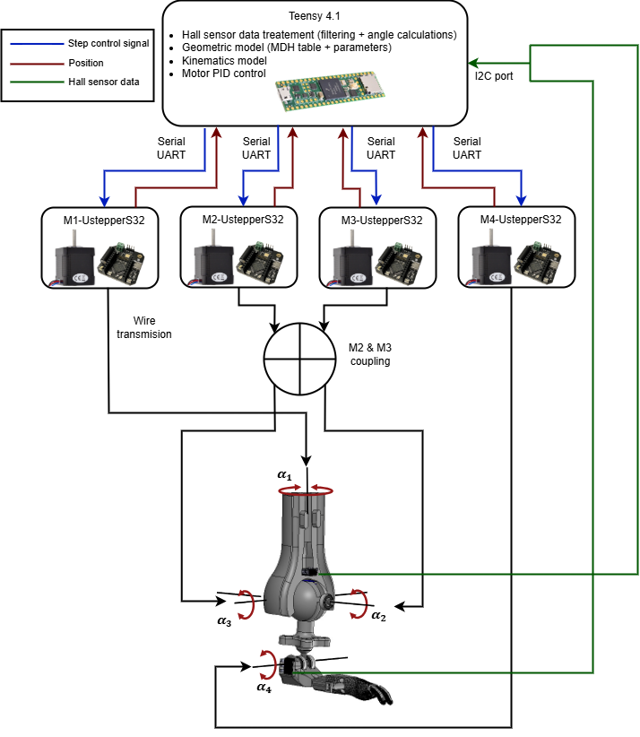

The prosthesis is composed of four UStepperS32 motors, which communicate via a serial connection with a central microcontroller, a Teensy 4.1. The microcontroller is responsible for the low-level control of the motors and allows commands to be sent either in Cartesian or joint coordinates.
The software also incorporates the geometric and kinematic models of the prosthesis, in particular to enable control based on Cartesian coordinates. In addition, it handles the data acquired from the Hall-effect sensors, which provide the joint positions of the prosthesis via an I²C bus.

The four motors control the following axes:
•	Motor M1 controls the α1 axis.
•	Motors M2 and M3 are mechanically coupled and jointly control the α2 and α3 axes.
•	Motor M4 controls the α4 axis.

{ width=100% .center }
M2 and M3 coupling means that both motors act on $\alpha_2$ and $\alpha_3$
