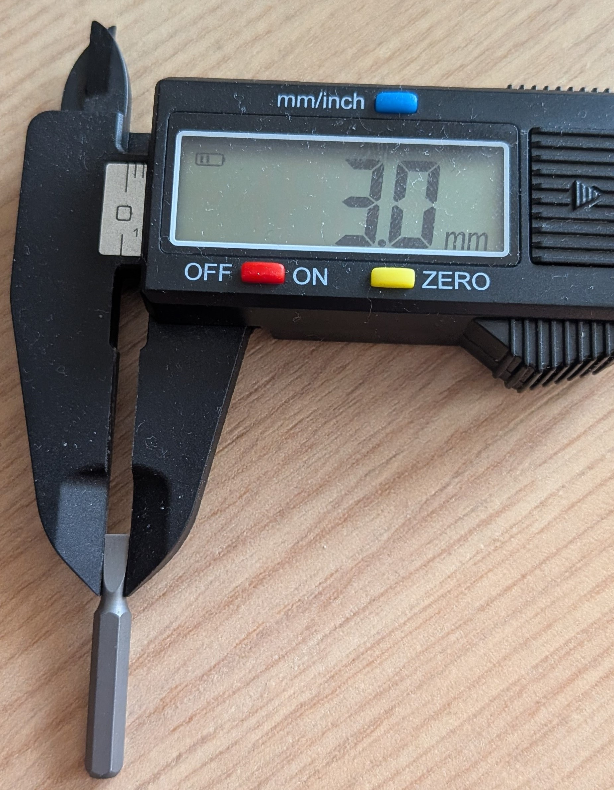
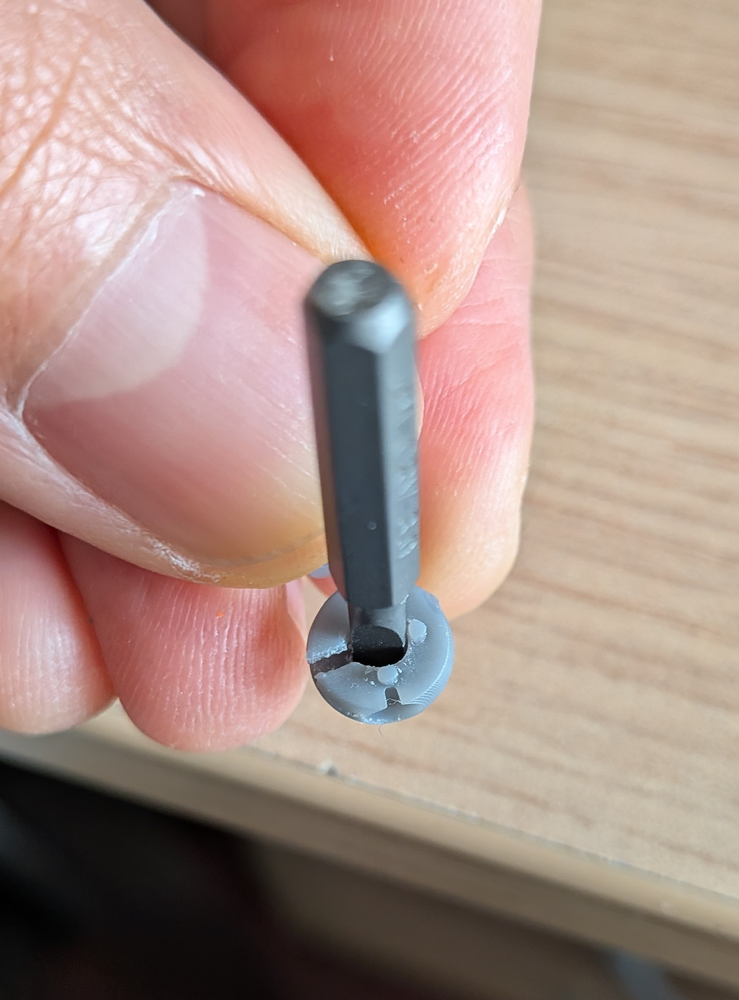

# assembling 

## Assembling the ball-arm 
El en samblaje de la ball arm puede requerir de pequenos detallados. Por ejemplo, importante que los pequenos rodamientos del 
[Yaw-lock system](mechanical_design.md#yaw_lock_system) puedan insertarse correctamente. Hemos usado herramientas de tallado para mejorar 
la redondez de la cavidad si es necesario

{ width=30% .center}

posteriormente nosotros hemos utilizado una punta plana de desarmadpr con el diametro exacto de los baleros (3 mm)  giramos 
en el interior para dar mejor forma. Debe ser con mucho cuidado para evitar quebrar la pieza 
cmo se muestra a continuacion y uti

{width=42% align=left}

{width=40% align=left}

## Assembling of the elbow joint 
## Elbow joint ball bearings
El resultado de soldar los pines en los mini rodamientos requiere modificar un poco las cavidades en el antebrazo. 
incluso si se puede hacer esta modificacion en el modelo 3D es muy posible que a esta escala la impresion no sea 
lo suficintemente precisa. Buscamos raspar la pieza intentando hacer la forma de la soldadura de estano mostrada 
en la siguiente figura

this photo is just an example it has to be replaced by a better one

{id="elbow_ball_bearings" width=40% .center }

Las cavidades de los mini rodamientos han sido repasadas con herramienta giratoria y uan punta de tallado.
Los dos agujeros para los pines han sido repasados con una broca de 1mm.

{ width=70% .center }

El poqueno agujero en la cavidad del sensor hall sirve para comprobar que el eje esta alineado si preentaos nuestro t-shaft para la articulacion 
del codo, debemos obtener algo como en la siguiente ficura. 

{ width=60% .center }

