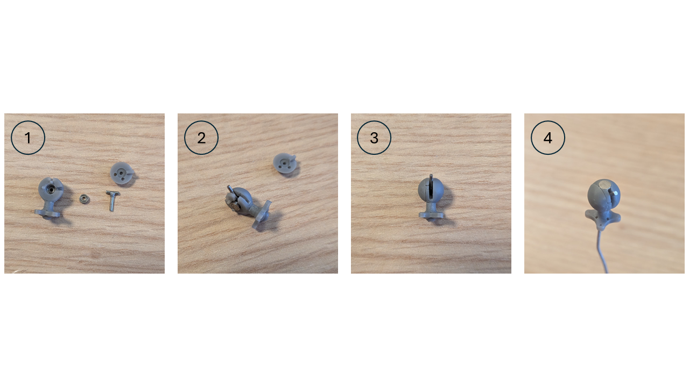
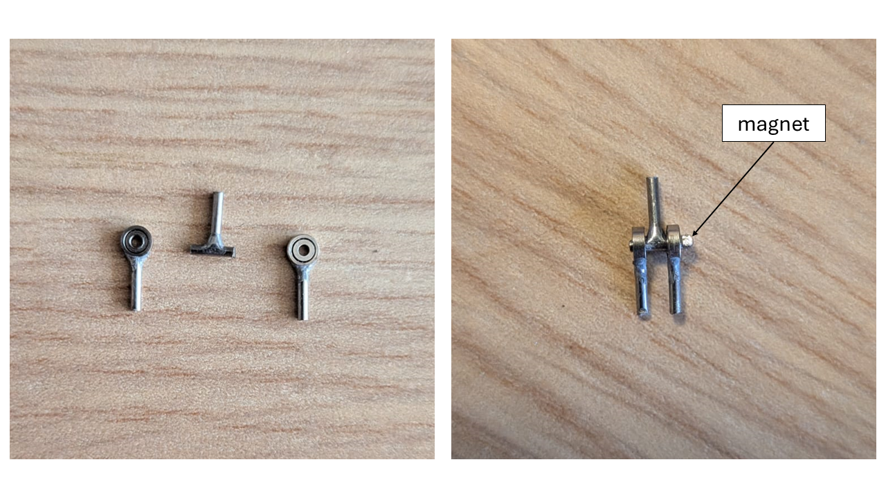
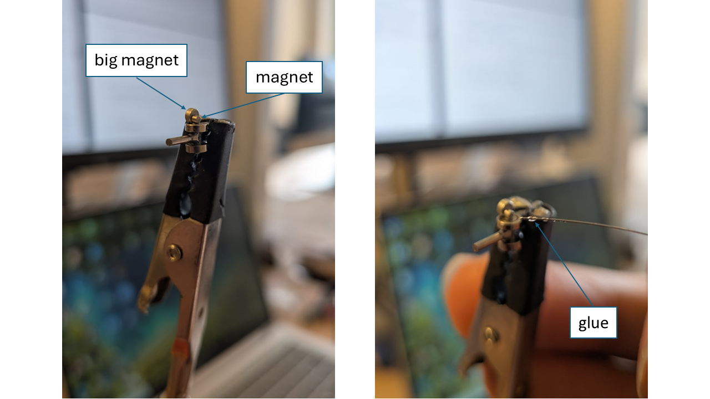

# Assembling and instrumentation
## Pieces assembling
### Assembling the ball-arm 
{width=40% .center}
El en samblaje de la ball arm puede requerir de pequenos detallados. Por ejemplo, importante que los pequenos rodamientos del 
[Yaw-lock system](mechanical_design.md#yaw_lock_system) puedan insertarse correctamente. Hemos usado herramientas de tallado para mejorar 
la redondez de la cavidad si es necesario

{ width=30% .center}

posteriormente nosotros hemos utilizado una punta plana de desarmadpr con el diametro exacto de los baleros (3 mm)  giramos 
en el interior para dar mejor forma. Debe ser con mucho cuidado para evitar quebrar la pieza 
cmo se muestra a continuacion y uti

{width=80% .center}

Pour que le ball arm puisse bien se mouvoir une fois dans la prothèse, on peut le poncer pour diminuer les frottements avec la socket si nécessaire. On doit pouvoir bouger la rotule dans toutes les directions avec 1 seul doigts, sans forcer.

To ensure that the ball arm can move properly once inserted into the prosthesis, it can be sanded if necessary to reduce friction with the socket. The ball joint should be able to move freely in all directions using a single finger, without applying force.
A 3 mm winding is inserted at the bottom of the rotule_short, after which the T-shaft is inserted inside it. A bearing is then placed on the other side of the T-shaft, and the assembly is closed with the sphere complement. Finally, the magnet is inserted into its designated slot, making sure that it does not protrude from the surface to prevent potential wear issues over time.

{width=100% .center}
### Motors suport

To make the prosthesis easier to handle, we added a support for the board on which the Teensy is mounted. This support is attached to the motor suport and helps prevent it from sagging..

{width=140% .center}

### Assembling of the elbow joint 
## Elbow joint ball bearings
El resultado de soldar los pines en los mini rodamientos requiere modificar un poco las cavidades en el antebrazo. 
incluso si se puede hacer esta modificacion en el modelo 3D es muy posible que a esta escala la impresion no sea 
lo suficintemente precisa. Buscamos raspar la pieza intentando hacer la forma de la soldadura de estano mostrada 
en la siguiente figura

{id="elbow_ball_bearings" width=70% .center }

Las cavidades de los mini rodamientos han sido repasadas con herramienta giratoria y uan punta de tallado.
Los dos agujeros para los pines han sido repasados con una broca de 1mm.

{ width=70% .center }

El poqueno agujero en la cavidad del sensor hall sirve para comprobar que el eje esta alineado si preentaos nuestro t-shaft para la articulacion 
del codo, debemos obtener algo como en la siguiente ficura. 

{ width=60% .center }
Once the shaft is properly aligned, the magnet can be glued onto the axis of the T-shape. We use a larger magnet to press the small magnet against it, making it easier to position it correctly. The rounded side of the magnet is glued against the axis of the T-shape.
{ width=90% .center }
### Assembling of the socket 
To ensure that the two parts of the socket can be securely assembled, we carefully scraped the two mounting features with a scalpel to make them thinner, as they did not fit into their designated holes.
After this modification, the two parts could be assembled, but they still did not remain securely in the assembled position. We therefore had to remove a small protrusion at the bottom of each hole using a cylindrical rotary cutter (avec le dremel).
{ width=60% .center } 
To fit the 3 mm bearing, we used a screwdriver with a 3 mm tip to widen the hole, make it perfectly circular, and remove any irregularities, as was done for the ball arm. It is important that the bearing is sufficiently recessed once positioned so that it does not protrude from the surface of the part. Otherwise, it would cause friction against the spherical part of the ball joint and lead to wear over time.
{ width=100% .center }

### Instrumentation
For our prosthesis, we need two sensors to track the movement of the two joints and thus determine the position of the limb at any given time.
###Soldering
The sensor's [datasheet](https://www.ti.com/lit/ds/symlink/tmag5273.pdf?ts=1777974658121&ref_url=https%253A%252F%252Fwww.ti.com%252Fsitesearch%252Fde-de%252Fdocs%252Funiversalsearch.tsp%253FlangPref%253Dde-DE%2526nr%253D8%2526searchTerm%253DTMAG5273A1QDBVR) provides the pinout of the sensor:
{width=50% .center}

he colors associated with each PIN correspond to the color of the cable soldered to it. The two ground PINs were soldered together onto a single cable.
 
 {width=140% .center}

The cables must not protrude beyond the surface of the sensor, otherwise the sensor will not fit into its designated slot within the socket. For this reason, we solder the cables to the inner side of the PINs.

{width=80% .center}
{width=80% .center}

### Pulley adjustement
The holes for the wires can be cleared using a Dremel with a 0.5 mm drill bit. The hole should not be drilled from scratch; instead, the existing hole should be cleared by following its original path. The hole should be drilled from the outside toward the inside of the part using a 0.5 mm drill bit.

{width=80% .center}
The screw holes must be enlarged using a Dremel with a 1.5 mm drill bit to facilitate the insertion of the screws during assembly. The holes for the wire-pulling mechanism and the covers are enlarged in the same way. These holes are then tapped to facilitate screw insertion during subsequent assembly.

{width=80% .center}

## Global assembling
{width=140% .center}
We first insert the ball arm into its designated slot within the socket (1), then slide the ring down to lock the two parts of the socket together (2).
{width=90% .center}
We then place the shoulder pulley assembly onto the socket and slide the two large bearings onto it (3). Once the bearings are in position, we place the shoulder pulley on top (4).
{width=90% .center}
We clip the support cache and the support main (parts 1 and 2) onto the bearings (5), and finish by positioning the uStepper support and the upper shoulder magnet as shown in (6). It is preferable to screw these tw last parts in place later, as they may interfere with the subsequent assembly steps.
{width=90% .center}

### Motors suport

To make the prosthesis easier to handle, we added a support for the board on which the Teensy is mounted. This support is attached to the motor suport and helps prevent it from sagging..

{width=140% .center}

To allow the motors to actuate the prosthesis, fishing line is used as the cable. It is wound around the pulleys on one end and attached to the end of the prosthesis on the other, as detailed below.

To prevent wear on the prosthesis, the cables are routed through [sleeves](https://www.vwr.com/fr/en/product/576865/null) with an inner diameter of 0.3 mm and an outer diameter of 1.5 mm. We use cables approximately 60–80 cm long and sleeves approximately 40–50 cm long. It is preferable to leave some extra length on the cables and cut off the excess at the end, as this makes handling and assembly easier.
On va d'abord passer les gaines dans leur trous pour vérifier qu'ils ne soient pas bouchés et les déboucher si nécessaire.
We first insert the sleeves through their respective holes to check that they are not clogged, and clear them if necessary.
The cables can then be inserted into the sleeves, leaving some excess length protruding from both ends.

For the following steps, it is important to know the orientation of the sensor inside the socket. Depending on its orientation, the way the cables are positioned on the pulleys will differ.
Configuration n°1 :
{width=80% .center}

Configuration n°2:
{width=100% .center}

The cables must be tied to the end of the prosthesis as shown below:

{width=100% .center}

At the other end, the cables are wound around the pulleys as shown below. The two images represent the same pulley, but show how the two cables are wound around it.
{width=80% .center}

Once the cables have been wound around the pulley, they are attached to the star wheel as shown below, finishing with a double knot large enough to prevent the cable from coming undone when tension is applied. Finally, the star wheel is turned in the indicated direction to wind the remaining cable around it.

{width=90% .center}

!!! info

    The winding direction ensures that tightening the screw increases the cable tension, while loosening it decreases the tension, rather than the opposite.
{width=80% .center}
Finally, we position the screws and attach the covers over them. The screws are then adjusted so that all the cables are properly tensioned. This ensures that the prosthesis starts moving as soon as the motor rotates, without any noticeable delay.
