# Assembling and instrumentation
## Pieces assembling
### Assembling the ball-arm 
El en samblaje de la ball arm puede requerir de pequenos detallados. Por ejemplo, importante que los pequenos rodamientos del 
[Yaw-lock system](mechanical_design.md#yaw_lock_system) puedan insertarse correctamente. Hemos usado herramientas de tallado para mejorar 
la redondez de la cavidad si es necesario

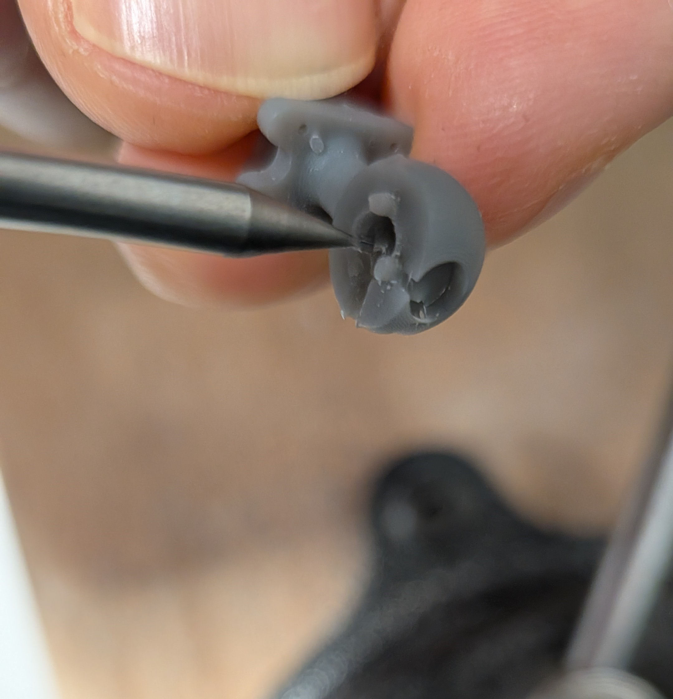{ width=30% .center}

posteriormente nosotros hemos utilizado una punta plana de desarmadpr con el diametro exacto de los baleros (3 mm)  giramos 
en el interior para dar mejor forma. Debe ser con mucho cuidado para evitar quebrar la pieza 
cmo se muestra a continuacion y uti

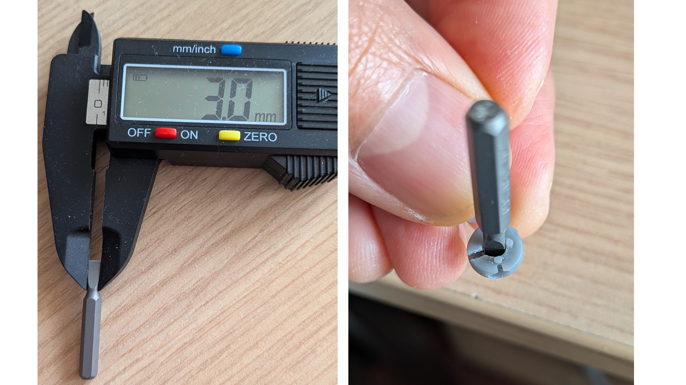{width=80% .center}

### Motors suport

To make the prosthesis easier to handle, we added a support for the board on which the Teensy is mounted. This support is attached to the motor suport and helps prevent it from sagging..

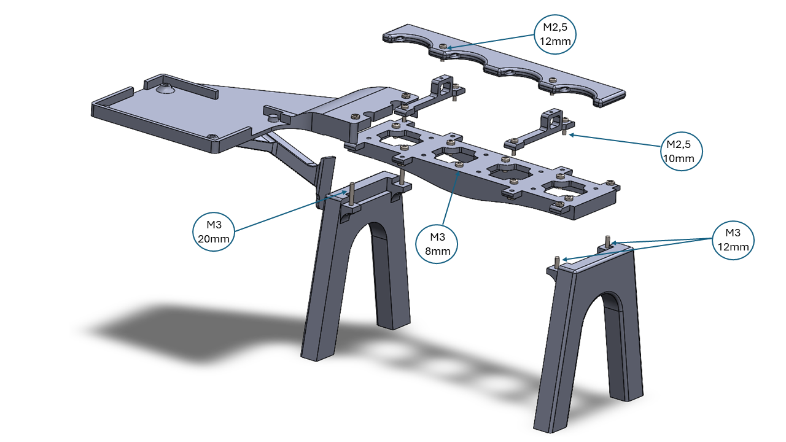{width=140% .center}

Pour que le ball arm puisse bien se mouvoir une fois dans la prothèse, on peut le poncer pour diminuer les frottements avec la socket si nécessaire. On doit pouvoir bouger la rotule dans toutes les directions avec 1 seul doigts, sans forcer.

On insère au fond de la rotule_short un enroulement de 3mm, puis on vient glisser le T-shaft à l'interieur. Puis on glisse un roulement de l'autre côté du T et on referme avec la sphere complement.
Enfin on vient insérer l'aimant dans son emplacement en veillant à ce qu'il ne dépasse pas pour éviter des problèmes d'usures plus tard.
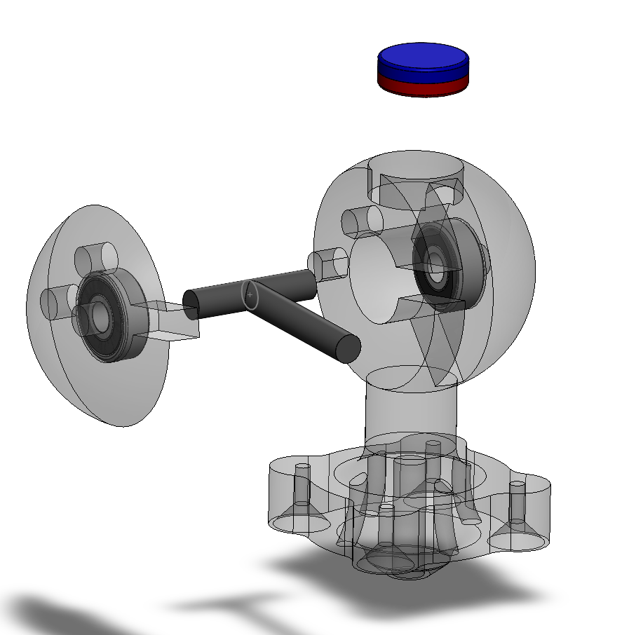{width=40% .center}

### Assembling of the elbow joint 
## Elbow joint ball bearings
El resultado de soldar los pines en los mini rodamientos requiere modificar un poco las cavidades en el antebrazo. 
incluso si se puede hacer esta modificacion en el modelo 3D es muy posible que a esta escala la impresion no sea 
lo suficintemente precisa. Buscamos raspar la pieza intentando hacer la forma de la soldadura de estano mostrada 
en la siguiente figura

this photo is just an example it has to be replaced by a better one

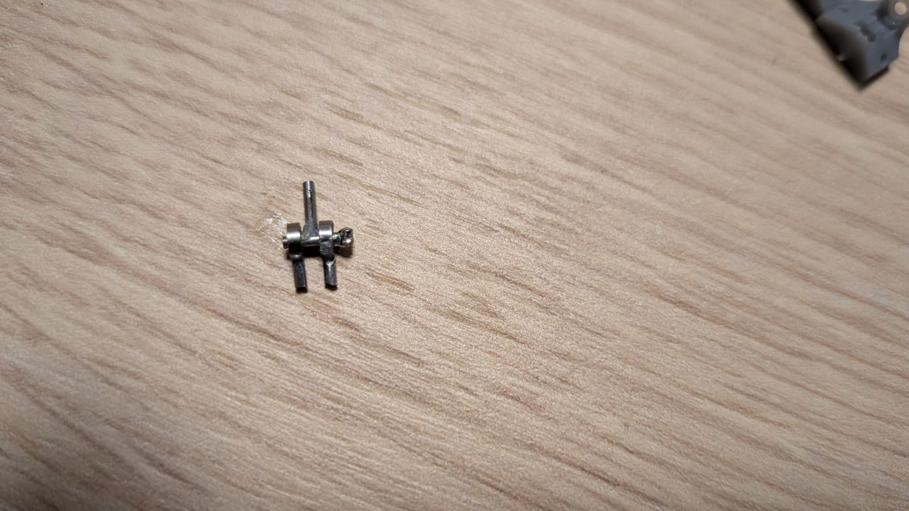{id="elbow_ball_bearings" width=40% .center }

Las cavidades de los mini rodamientos han sido repasadas con herramienta giratoria y uan punta de tallado.
Los dos agujeros para los pines han sido repasados con una broca de 1mm.

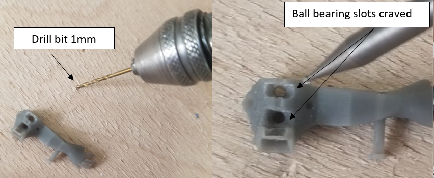{ width=70% .center }

El poqueno agujero en la cavidad del sensor hall sirve para comprobar que el eje esta alineado si preentaos nuestro t-shaft para la articulacion 
del codo, debemos obtener algo como en la siguiente ficura. 

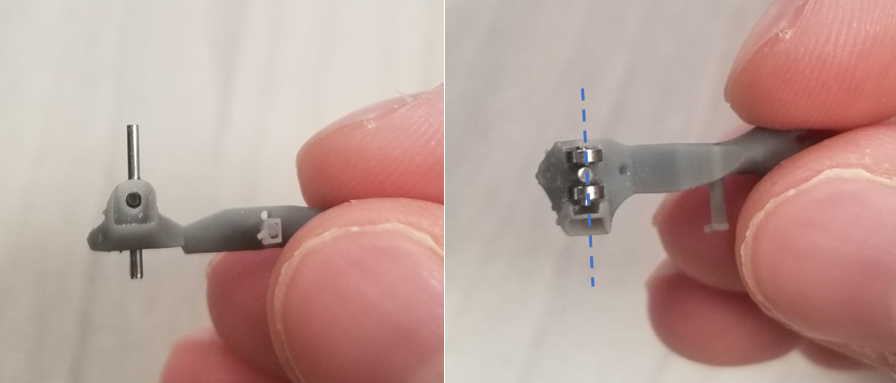{ width=60% .center }
### Assembling of the socket 
Pour que les deux parties de la socket puisse tenir ensemble, on a gratté au scalpel les deux reliefs de fixation pour les affiner, car ils ne rentraient pas dans leurs trous dédiés.
Suite à ça, l’emboitement était possible mais les 2 pièces ne tenaient toujours pas dans la position emboitée. Il a fallu retirer à l’aide d’une fraise (cylindrique) un petit relief présent au fond de chacun des trous.
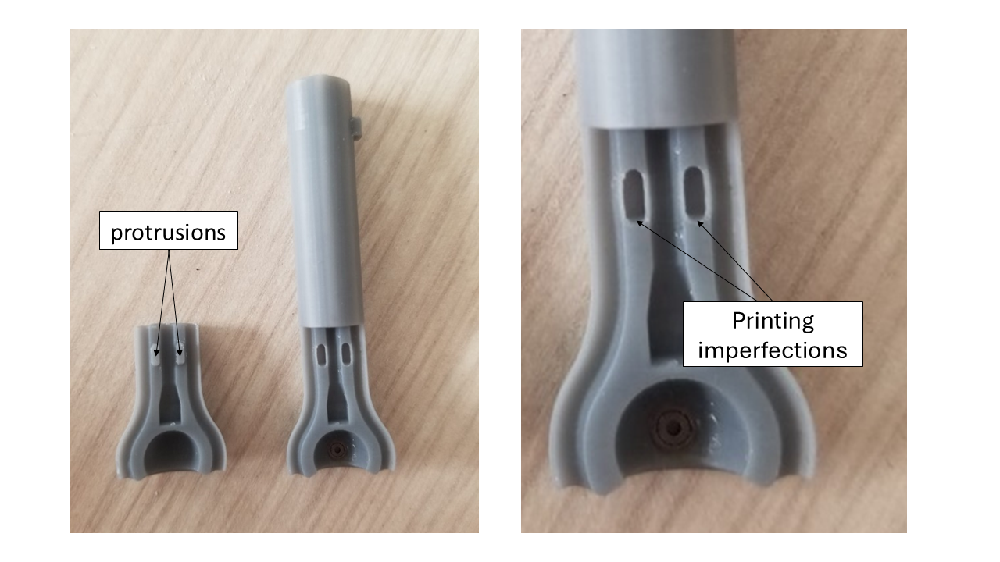{ width=60% .center } 
Pour pouvoir placer le roulement de 3mm on a utilisé un tournevis avec un embout de 3mm pour élargir le trou, le rendre parfaitement circulaire et enlever les irrégularités (same as the ball arm). Il est important que le roulement, une fois positionné, soit suffisamment enfoncé pour qu’il ne dépasse pas de la surface de la pièce car sinon cela causerait des frottements sur la partie sphérique de la rotule et l’userai sur le long terme.
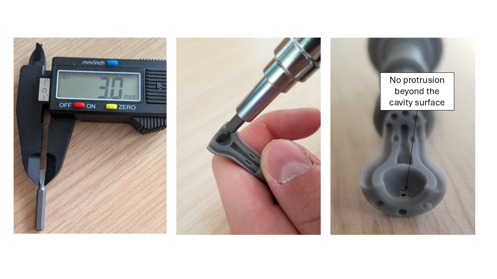{ width=100% .center }

### Instrumentation
Pour notre prothèse, nous avons besoin de 2 capteurs afin de traquer le mouvement au niveau des 2 articulations de la prothèse et ainsi être en mesure de connaître la position de la patte à tout instant.

###Soldering
La [datasheet](https://www.ti.com/lit/ds/symlink/tmag5273.pdf?ts=1777974658121&ref_url=https%253A%252F%252Fwww.ti.com%252Fsitesearch%252Fde-de%252Fdocs%252Funiversalsearch.tsp%253FlangPref%253Dde-DE%2526nr%253D8%2526searchTerm%253DTMAG5273A1QDBVR) du capteur nous donne l'emplacement de ces différents PIN :
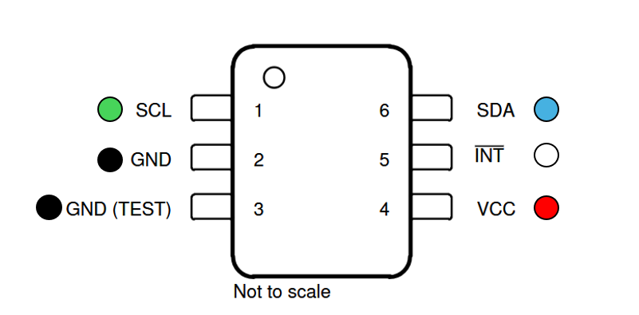{width=50% .center}

Les couleurs associées à chacun des PIN correspondent à la couleur du câble que nous avons soudé sur ce dernier. Nous avons soudé les 2 PIN ground ensemble, sur un même câble.
 
 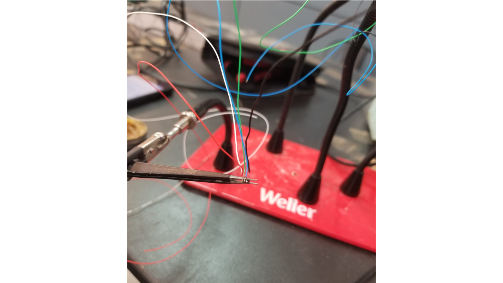{width=140% .center}

Les câbles ne doivent pas dépasser de la surface du capteur, sinon il ne pourra pas rentrer dans son emplacement au sein de la socket. Pour cette raison, nous soudons les câbles sur la partie interne des PIN. 
 
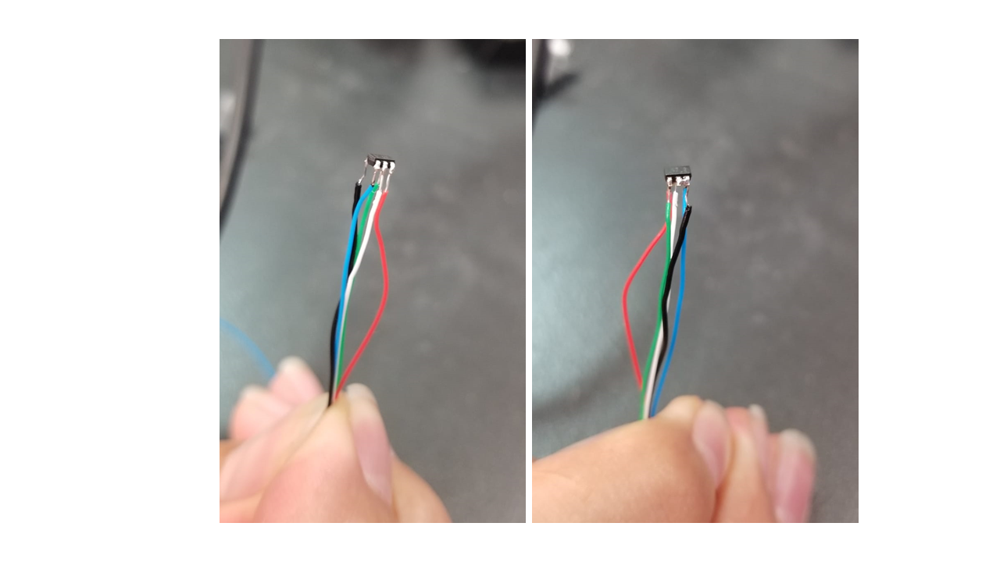{width=80% .center}
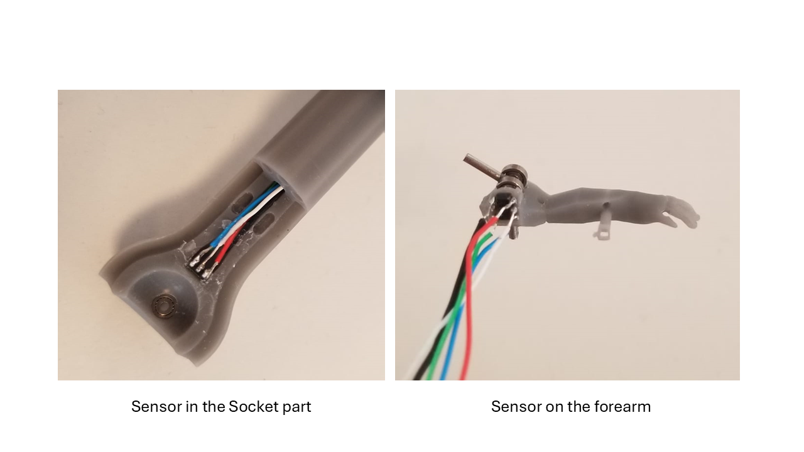{width=80% .center}

### Pulley adjustement
Les trous pour les fils peuvent être refait au Dremel avec un forêt de 0.5mm. Il ne faut pas recréer le trou de zéro, mais le déboucher en suivant le trou d’origine. On perce de l’extérieur vers l’intérieur de la pièce à l'aide d'un 0.5 mm drill bit.

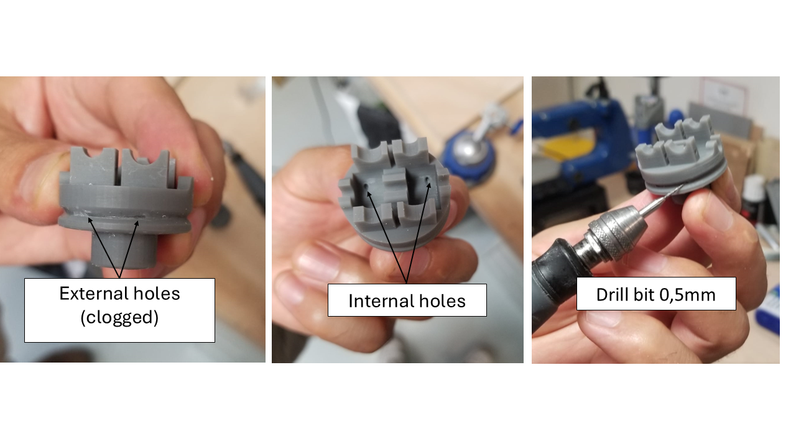{width=80% .center}
Les trous pour les vis doivent être élargis au Dremel avec un forêt de 1.5mm, pour faciliter le passage des vis lors du montage. On repasse ceux de du tire fils et ceux des caches. On vient ensuite tarauder ces même trous pour faciliter le passage des vis par la suite.
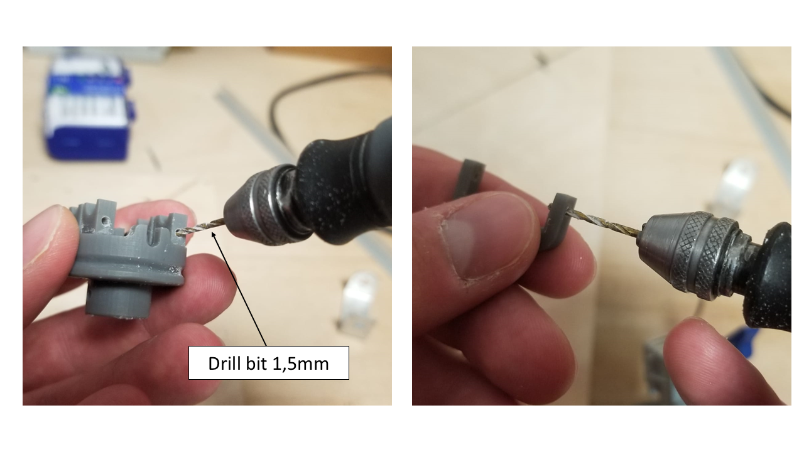{width=80% .center}

## Global assembling
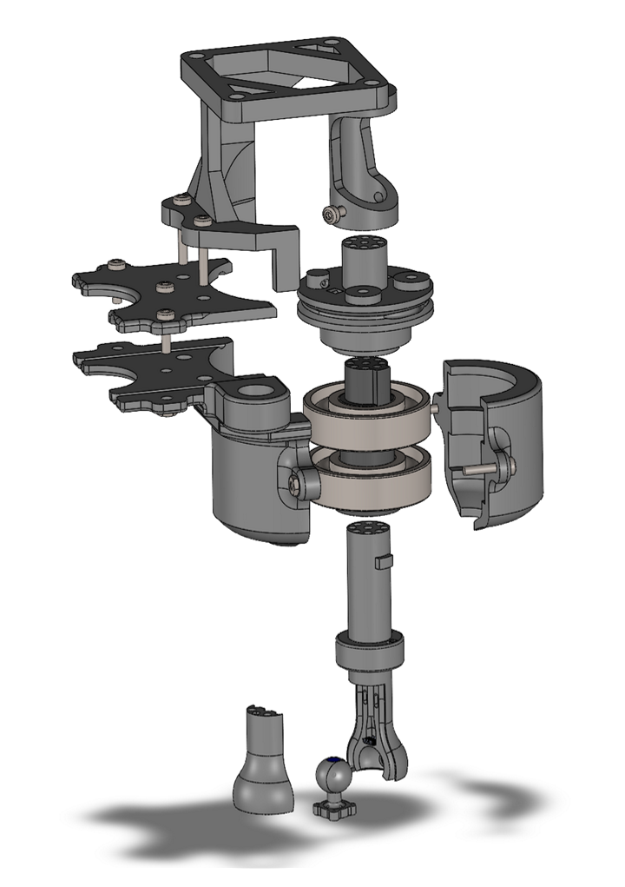{width=140% .center}

On commence par insérer le ball arm dans son emplacement au sein de la socket (1), puis on fait glisser le ring jusqu'en bas pour verouiller les 2 parties de la socket ensemble (2).
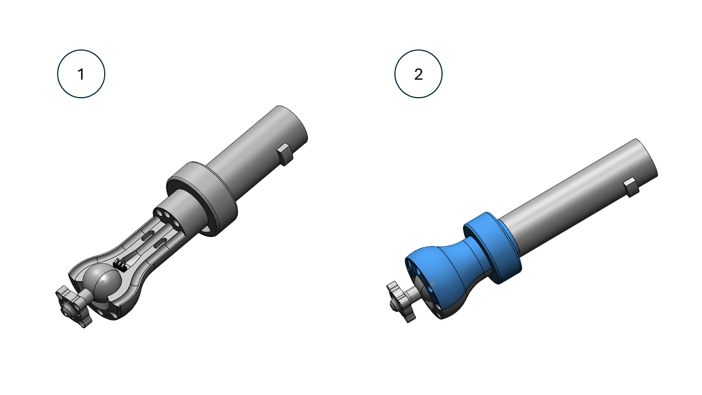{width=90% .center}
On insère ensuite le couple shoulder pulley sru la socket et on glisse les 2 gros roulement dessus (3). Une fois les roulements positionner on ajoute la shoulder pulley par dessus (4).
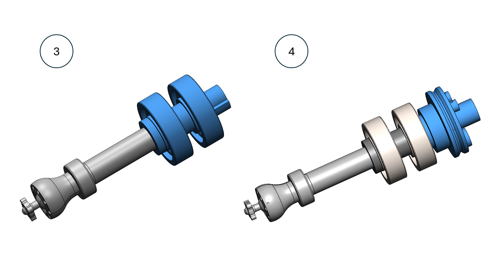{width=90% .center}
On clipse le support cache et le support main (part 1 and 2) sur les roulements (5), et on finit en positionnant le support ustepper et l'upper shoulder magnet comme indiqué dans (6). Il vaut mieux visser ces pièce plus tard, car elles sont susceptibles de gêner lors de la suite de l'assemblage.
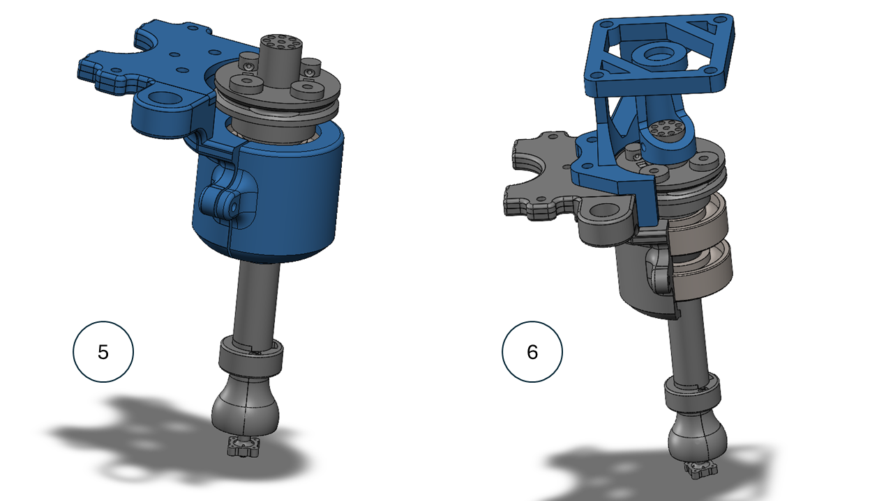{width=90% .center}

Pour que les moteurs puissent agir sur la prothèse, on utilise du fils de pêche en guise de câble, que l'on enroule autour des poulies d'un côté et que l'on attache à l'extrémité de la prothèse de l'autre, comme détaillé ci-dessous.

Pour éviter d'user la prothèse, on passe les câbles dans des [gaines](https://www.vwr.com/fr/en/product/576865/null) de 0.3mm de diamètre interne et 1.5mm de diamètre externe. On utilise des câbles d'environ 60-80cm de longueur et des gaines de 40-50cm de longueur. Il vaut mieux prendre de la marge sur la longueur des câble et couper ce qui dépasse à la fin pour faciliter les manipulations.
On va d'abord passer les gaines dans leur trous pour vérifier qu'ils ne soient pas bouchés et les déboucher si nécessaire.
On peut ensuite glisser les câbles dans les gaines, en laissant dépasser de la longueur des 2 côtés.

Pour la suite il est important de connaitre la position dans laquelle le capteur est positionné dans la socket. En fonction du sens dans lequel il est, la positionnement des câbles dans les poulies sera différent:

Configuration n°1 :
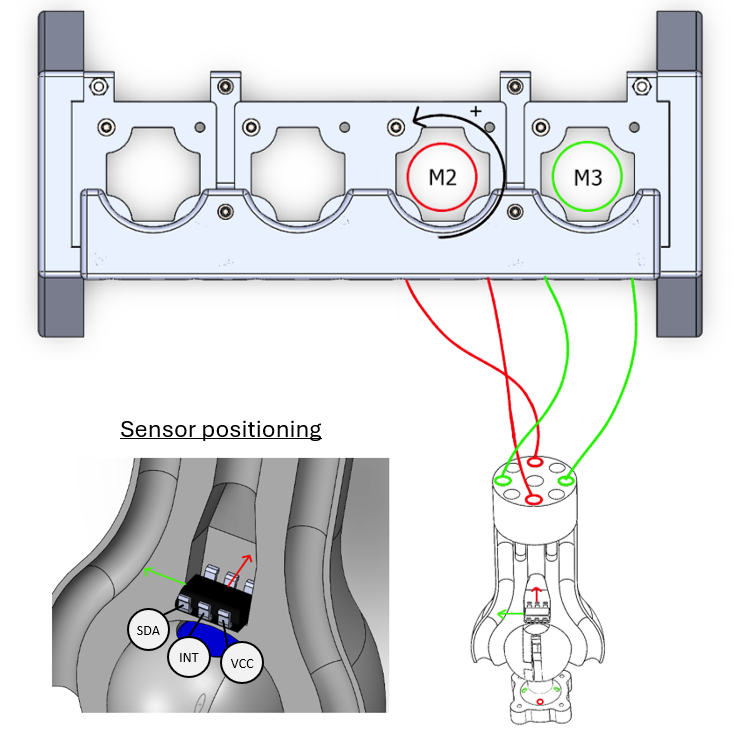{width=80% .center}

Configuration n°2:
{width=100% .center}

Il faut nouer les câble à l'extrémité de la prothèse comme cela :

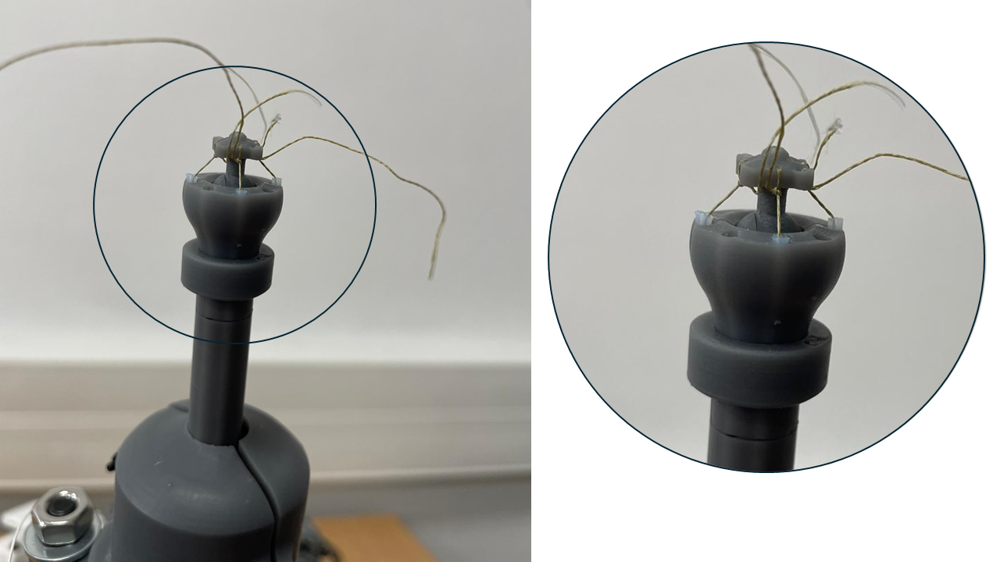{width=100% .center}

Et de l'autre côté, on enroule les câbles autour des poulies comme montré ci-dessous. Les 2 images représentent la même poulie, mais on a représenté la façon dont s'enroule les 2 câbles pour cette même poulie.
{width=80% .center}

Une fois les câbles enroulés autour de la poulie, on les attache aux star wheel comme ceci, en finissant par un double noeud suffisament gros pour que le câble ne se défasse pas quand il sera mis en tension. Enfin on tourne les star wheel dans le sens indiqué, de manière à enrouler le reste du câble autour.

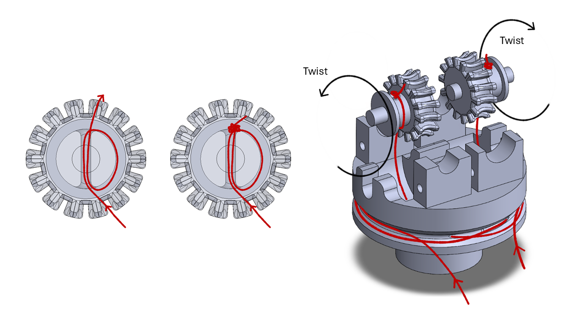{width=90% .center}

Le sens d'enroulement permet de faire en sorte que lorsqu'on visse, la tension du câble augment et lorsque l'on dévisse, sa tension diminue.
{width=80% .center}
