# Assembling and instrumentation
## Assembling the ball-arm 
The first element of the prosthesis you have to assemble is the ball joint arm. 

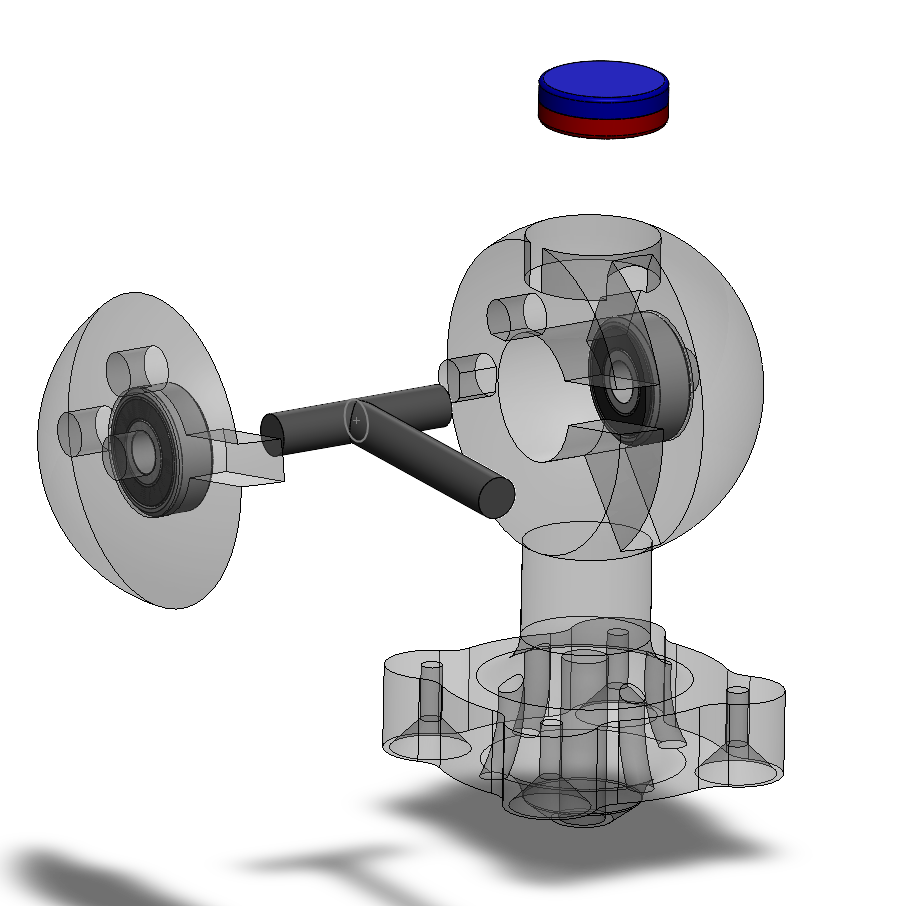{width=40% .center .on-glb}

As described in the [3D printing](3D_printing.md) section, although resin printing is a great ally for small, highly detailed prototypes, it does have its limitations. The chamber of the [Yaw-lock system](mechanical_design.md#yaw_lock_system) may require small, detailed adjustments. If the cavity for the mini bearings suffered deformation, the interior will need to be carefully carved to restore its cylindrical shape.

To carve the inside of the ball, we used the cylindrical carving bit shown in the following image.

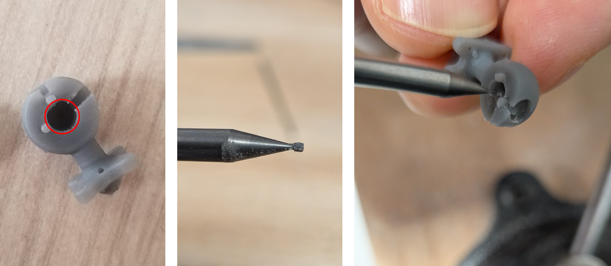{ width=70% .center .on-glb}.

We then used a screwdriver  flat-tip with the exact diameter of the ball bearings (3 mm). You have to rotate and apply pressure to the inside to shape it better. 

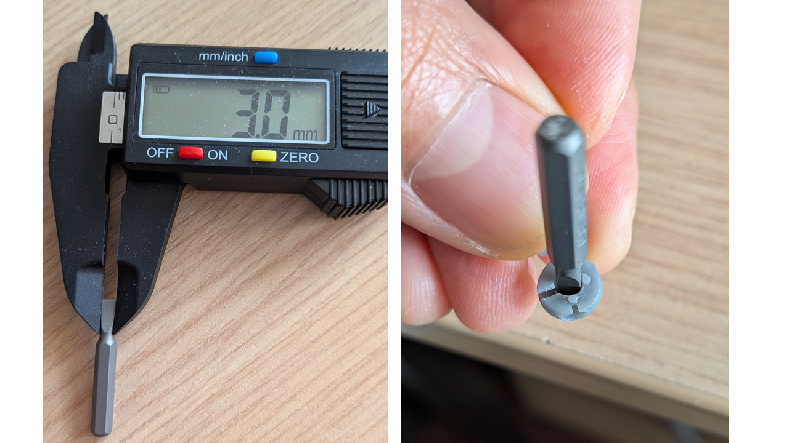{width=80% .center}

You must be very careful with craving the piece to ensure that the small bearings can be inserted correctly and fit snugly. 

A first bearing is inserted at the bottom of the ball, after which the T-shaft is inserted inside it. A bearing is then placed on the other side of the T-shaft, and the assembly is closed with the sphere lid. Finally, the magnet is inserted into its designated slot, making sure that it does not protrude from the surface to prevent potential wear issues over time.

When the inside of the ball is ready we can install the [Yaw-lock system](mechanical_design.md#yaw_lock_system). 

 - 1 First, insert a mini bearing. Make sure it doesn't go crooked into the cavity.
 - 2 Using the 3 mm  screwdriver flat-tip, gently push the bearing until it touches the bottom of the cavity. Push evenly so it doesn't get crooked.
 - 3 Now take your [T-shaft](soldering.md#T_shaft_finish) and insert the shorter segment into the embedded mini bearing.
 - 4 Insert the second mini bearing by fitting it onto the ball and letting the T-shaft segment pass through it.
 - 5 Check that the components are properly aligned. The T-shaft must be centered in its movement slot; if it isn’t, make sure the first bearing is seated all the way to the bottom of the slot.
 - 6 Put on the lid ball. Verify that the T-shaft movement is not stiff.

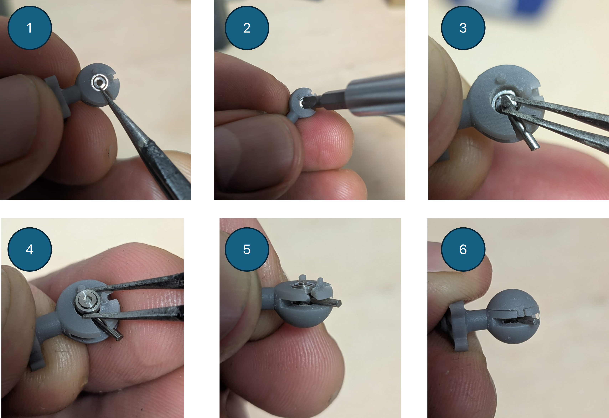{ width=50% .center .on-glb}

If the teshaft moves stiffly, the first bearing is probably not fully seated at the bottom, so you may need to scrape the inside of the ball a little more.
If you're sure the minibearing is seated all the way to the bottom, take a 1-millimeter drill bit and re-drill the cavity shown in the following image.

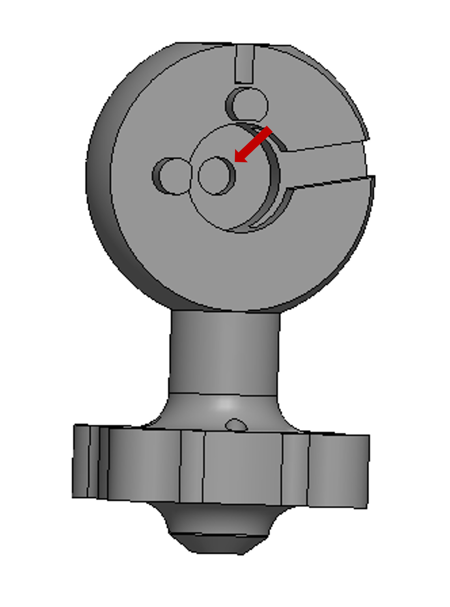{ width=30% .center}

If it's still too stiff after that, go over the recesses of the ball lid with the carving bit, as shown in the image below.

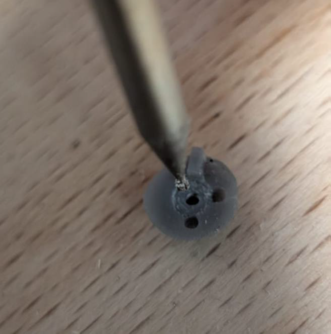{width=30% .center .on-glb}

{: style='width: 60%'}

If the spherical surface of any of the parts has come out of the print with deformations, you'll probably have to reshape it by hand.

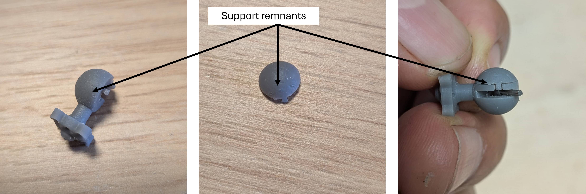{ width=60% .center .on-glb}

!!! tip 
    You must consider the printing support remnants too. They will cause friction inside the socket and they might not let pieces to fit as you can see in the image below. 

You might have to sand down the pieces to reduce friction with the socket, to remove any remaining material from surface and  adjusting the shape . 
Use 800-grit sandpaper to degrade and a 100-grit to polish. You can use a scalpel to carefully scrape other surfaces if needed.

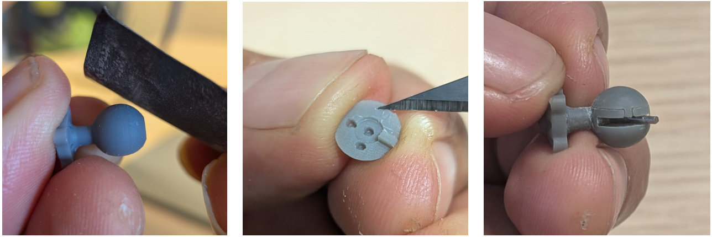{ width=70% .center .on-glb}

## Assembling of the socket 
To ensure that the two parts of the socket can be securely assembled, we had to carefully scrap the two mounting features with a scalpel to make them thinner, as they did not fit into their designated holes.
After this modification, the two parts could be assembled, but they still did not remain securely in the assembled position. We therefore had to remove a small protrusion at the bottom of each hole using a cylindrical  carving bit.
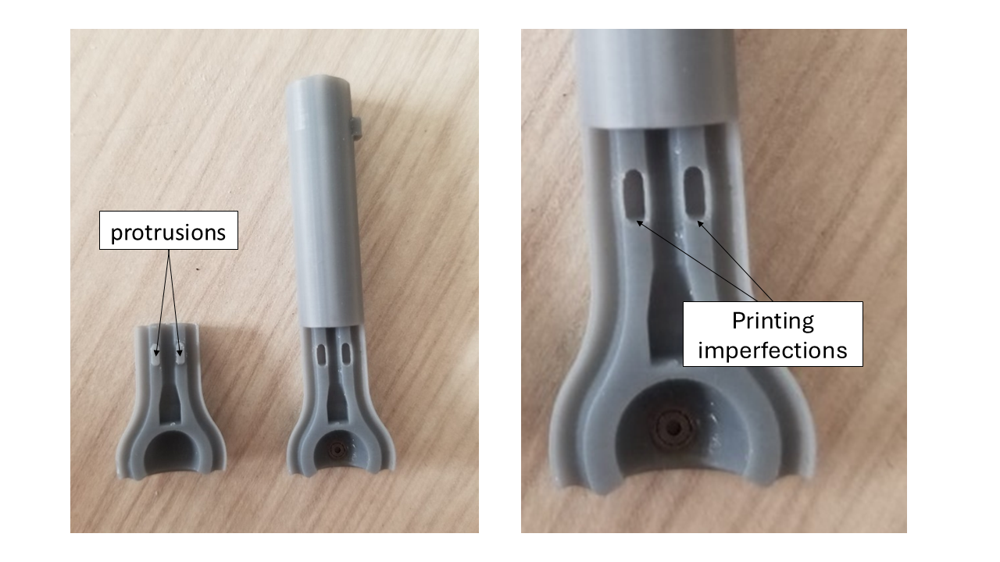{ width=60% .center .on-glb } 

To fit the 3 mm bearing, we used a screwdriver with a 3 mm tip to widen the hole, make it perfectly circular, and remove any irregularities, as was done for the ball arm. It is important that the bearing is sufficiently recessed once positioned so that it does not protrude from the surface of the part. Otherwise, it would cause friction against the spherical part of the ball joint and lead to wear over time.
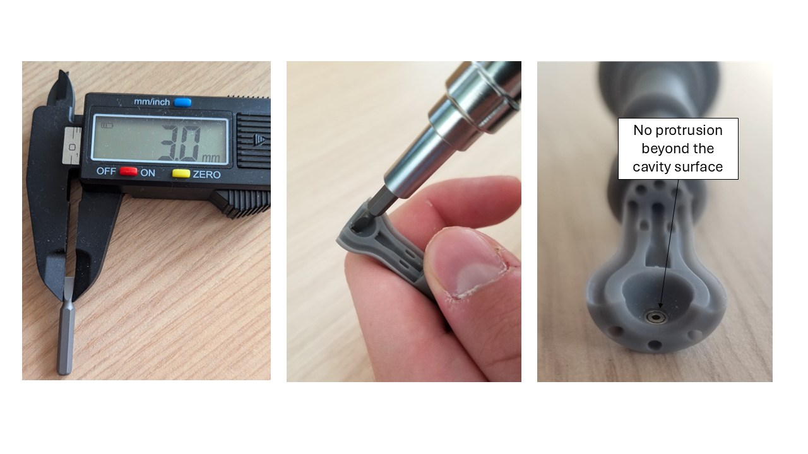{ width=100% .center }

You can now proceed to assemble the socket and the ball-arm to form the ball joint and test the stifness of the joint. To know if your joint will work well, it should be possible to move the ball joint in all directions with just one finger, without using much force. 

## Assembling of the elbow joint 
### Elbow joint ball bearings
To ensure the mini bearings with pins fit properly, the recesses in the forearm need to be modified slightly.
Even if this modification can be made in the 3D model, it’s very likely that the print won’t be precise enough at this scale. 
We’ll scrape the part, trying to create the shape of the solder joint shown in the following figure.

The following image shows how the recesses for the mini bearings have been reworked with a rotary tool and a carving bit.
The two holes for the pins have been reamed with a 1mm drill bit.
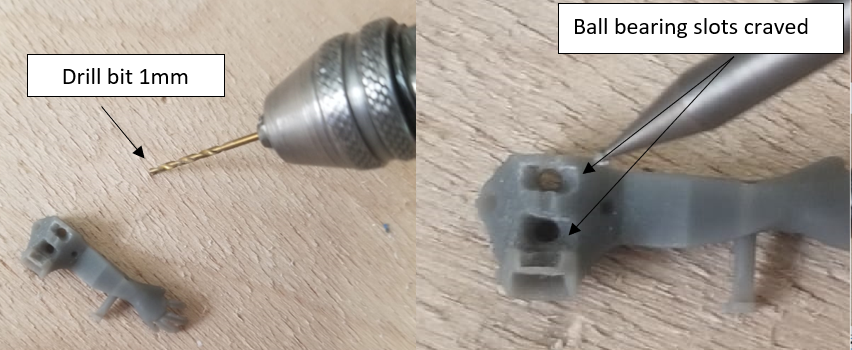{ width=70% .center }

The small hole in the Hall sensor cavity is used to check that the shaft is aligned. If you look at our T-shaft for the elbow joint, you should see something like what is shown in the following figure.

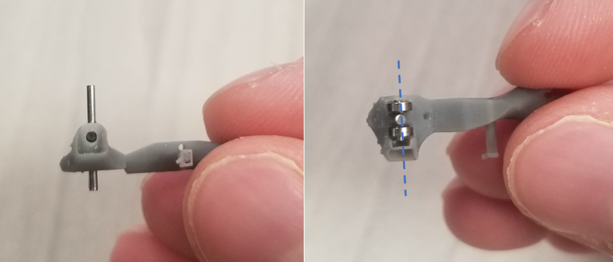{ width=60% .center }
Once the shaft is properly aligned, the magnet can be glued onto the axis of the T-shape. We use a larger magnet to press the small magnet against it, making it easier to position it correctly. The rounded side of the magnet is glued against the axis of the T-shape.

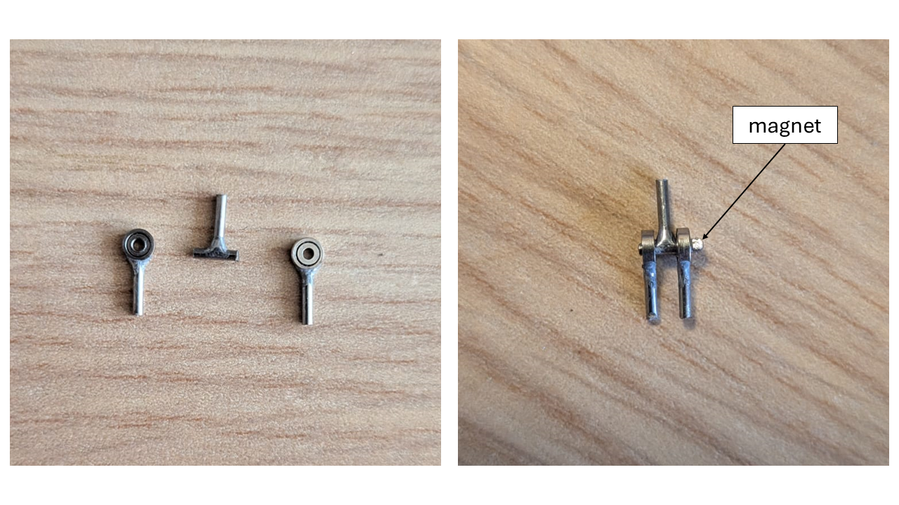{id="elbow_ball_bearings" width=70% .center }

### Instrumentation
For our prosthesis, we need two sensors to track the movement of the two joints and thus determine the position of the limb at any given time.

The sensor's [datasheet](https://www.ti.com/lit/ds/symlink/tmag5273.pdf?ts=1777974658121&ref_url=https%253A%252F%252Fwww.ti.com%252Fsitesearch%252Fde-de%252Fdocs%252Funiversalsearch.tsp%253FlangPref%253Dde-DE%2526nr%253D8%2526searchTerm%253DTMAG5273A1QDBVR) provides the pinout of the sensor:
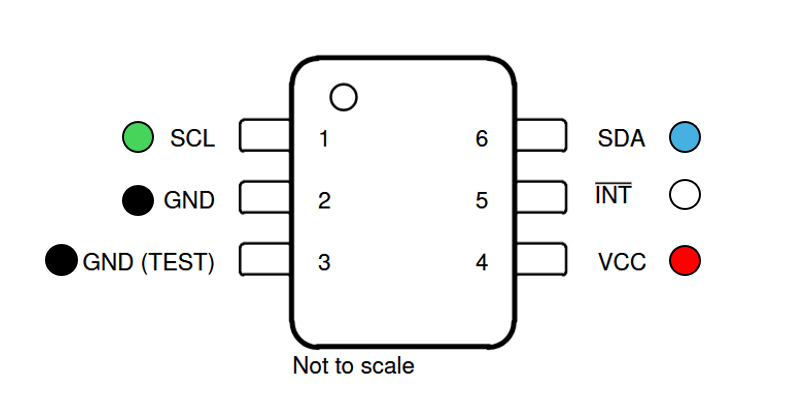{width=50% .center}

The colors associated with each PIN correspond to the color of the cable soldered to it. The two ground PINs were soldered together onto a single cable.
 
 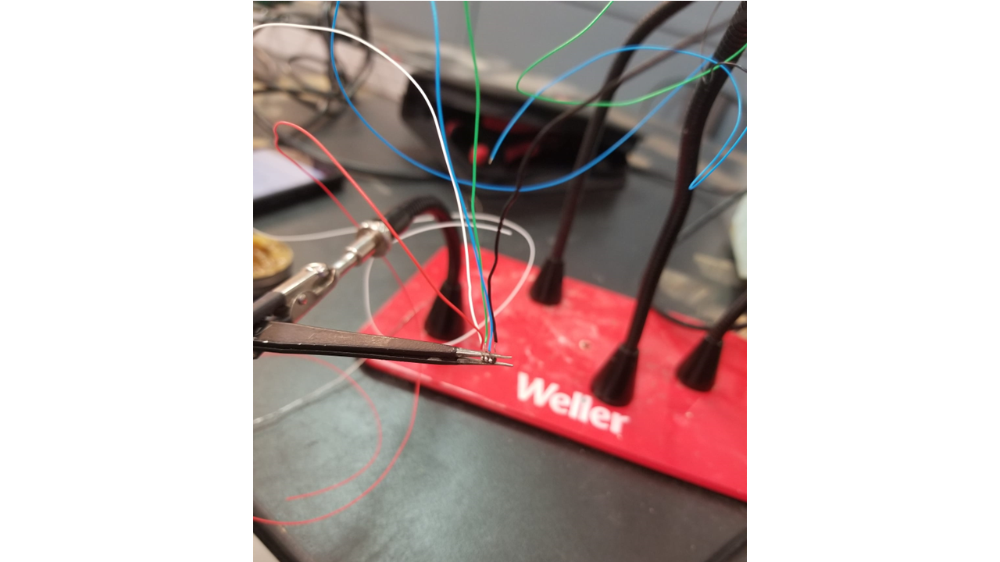{width=140% .center .on-glb}

The cables must not protrude beyond the surface of the sensor, otherwise the sensor will not fit into its designated slot within the socket. For this reason, we solder the cables to the inner side of the PINs.

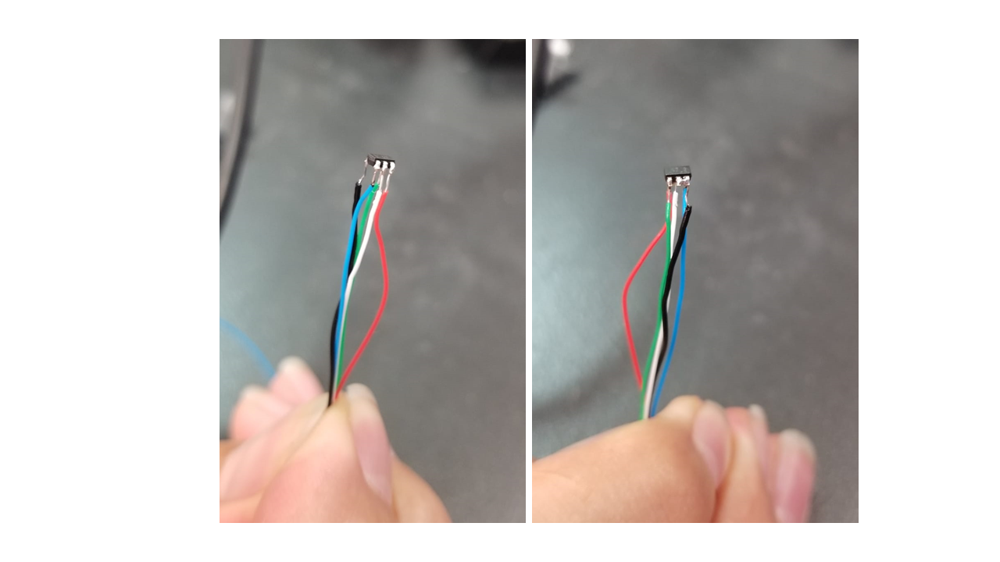{width=80% .center .on-glb}
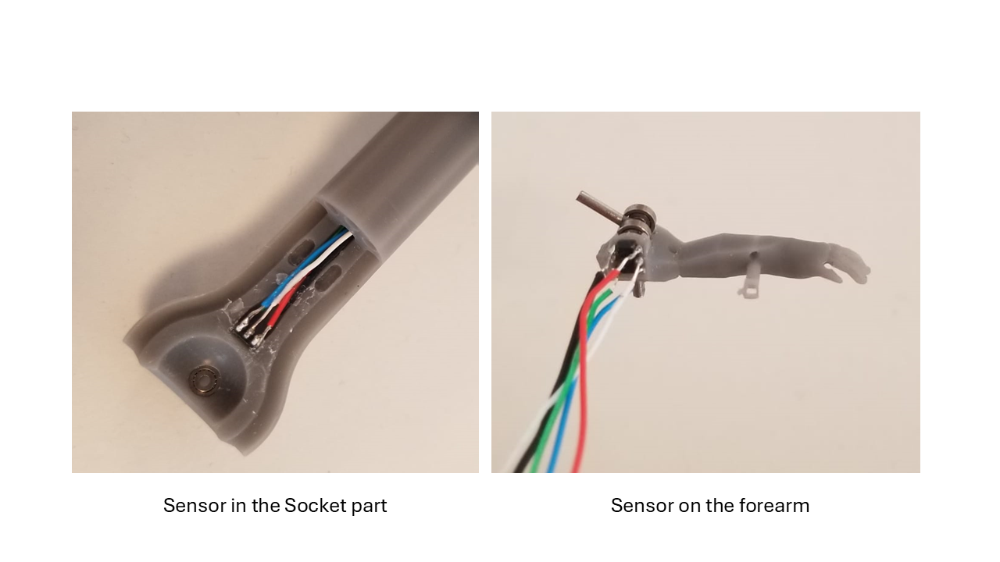{width=80% .center .on-glb}

### Pulley adjustement
The holes for the wires can be cleared using a Dremel with a 0.5 mm drill bit. The hole should not be drilled from scratch; instead, the existing hole should be cleared by following its original path. The hole should be drilled from the outside toward the inside of the part using a 0.5 mm drill bit.

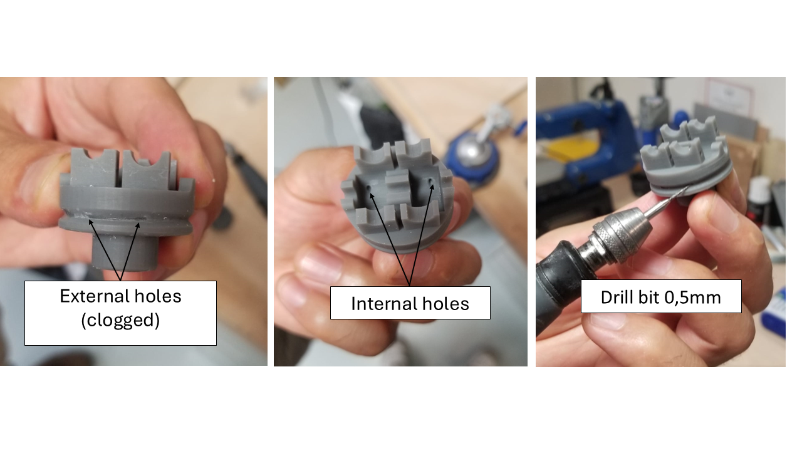{width=80% .center .on-glb}
The screw holes must be enlarged using a Dremel with a 1.5 mm drill bit to facilitate the insertion of the screws during assembly. The holes for the wire-pulling mechanism and the covers are enlarged in the same way. These holes are then tapped to facilitate screw insertion during subsequent assembly.

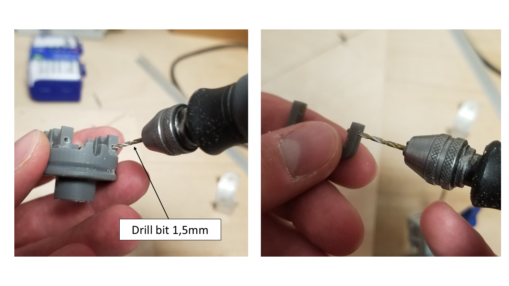{width=80% .center}

## Global assembling
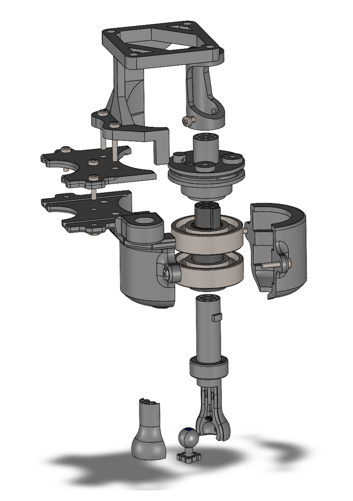{width=140% .center}
We first insert the ball arm into its designated slot within the socket (1), then slide the ring down to lock the two parts of the socket together (2).
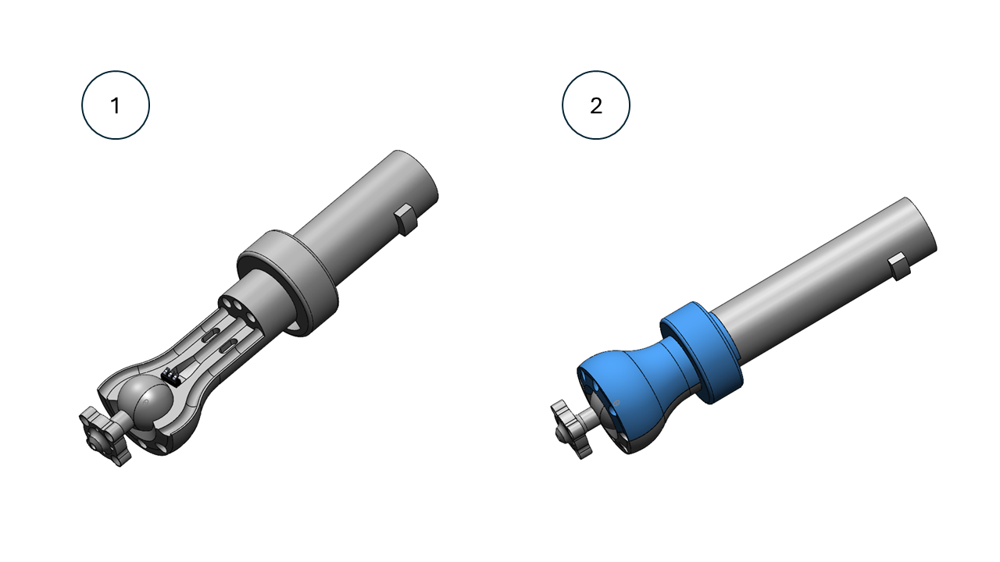{width=90% .center}
We then place the shoulder pulley assembly onto the socket and slide the two large bearings onto it (3). Once the bearings are in position, we place the shoulder pulley on top (4).
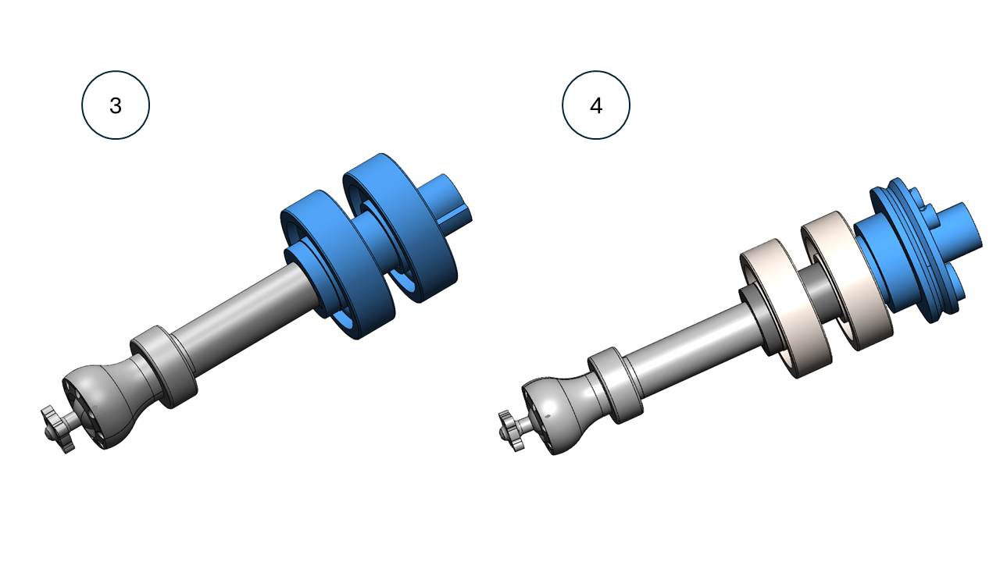{width=90% .center}
We clip the support cache and the support main (parts 1 and 2) onto the bearings (5), and finish by positioning the uStepper support and the upper shoulder magnet as shown in (6). It is preferable to screw these tw last parts in place later, as they may interfere with the subsequent assembly steps.
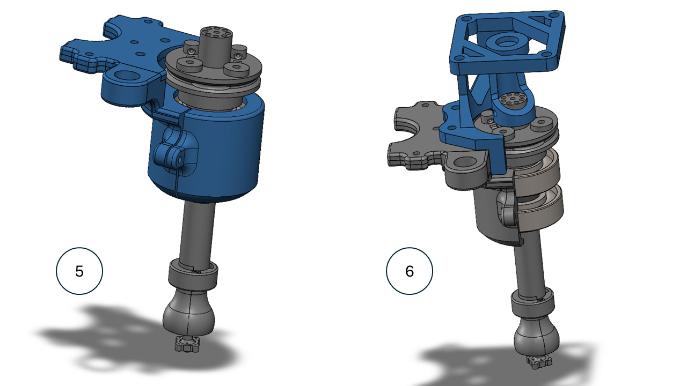{width=90% .center}

### Motors suport

To make the prosthesis easier to handle, we added a support for the board on which the Teensy is mounted. This support is attached to the motor suport and helps prevent it from sagging..

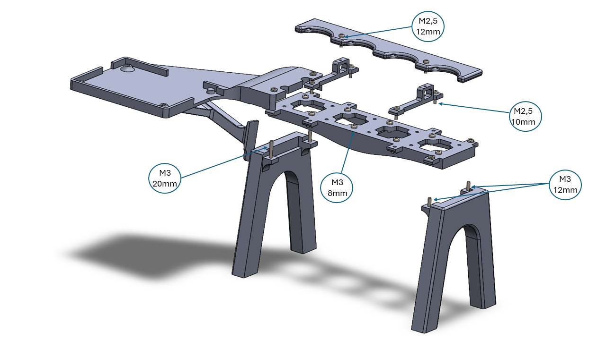{width=140% .center}

To allow the motors to actuate the prosthesis, fishing line is used as the cable. It is wound around the pulleys on one end and attached to the end of the prosthesis on the other, as detailed below.

To prevent wear on the prosthesis, the cables are routed through [sleeves](https://www.vwr.com/fr/en/product/576865/null) with an inner diameter of 0.3 mm and an outer diameter of 1.5 mm. We use cables approximately 60–80 cm long and sleeves approximately 40–50 cm long. It is preferable to leave some extra length on the cables and cut off the excess at the end, as this makes handling and assembly easier.
On va d'abord passer les gaines dans leur trous pour vérifier qu'ils ne soient pas bouchés et les déboucher si nécessaire.
We first insert the sleeves through their respective holes to check that they are not clogged, and clear them if necessary.
The cables can then be inserted into the sleeves, leaving some excess length protruding from both ends.

For the following steps, it is important to know the orientation of the sensor inside the socket. Depending on its orientation, the way the cables are positioned on the pulleys will differ.
Configuration n°1 :
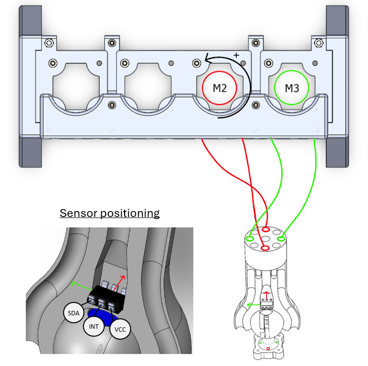{width=80% .center}

Configuration n°2:
{width=100% .center}

The cables must be tied to the end of the prosthesis as shown below:

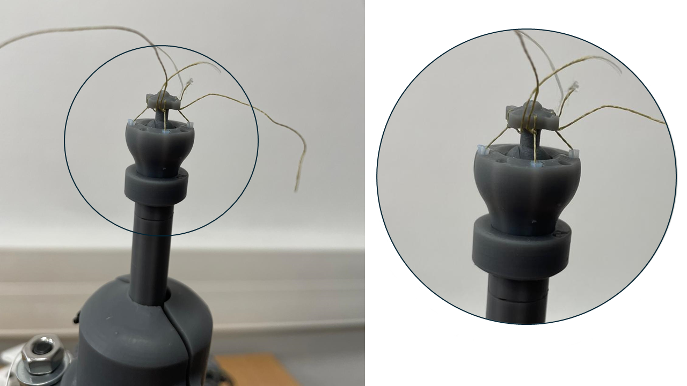{width=100% .center}

At the other end, the cables are wound around the pulleys as shown below. The two images represent the same pulley, but show how the two cables are wound around it.
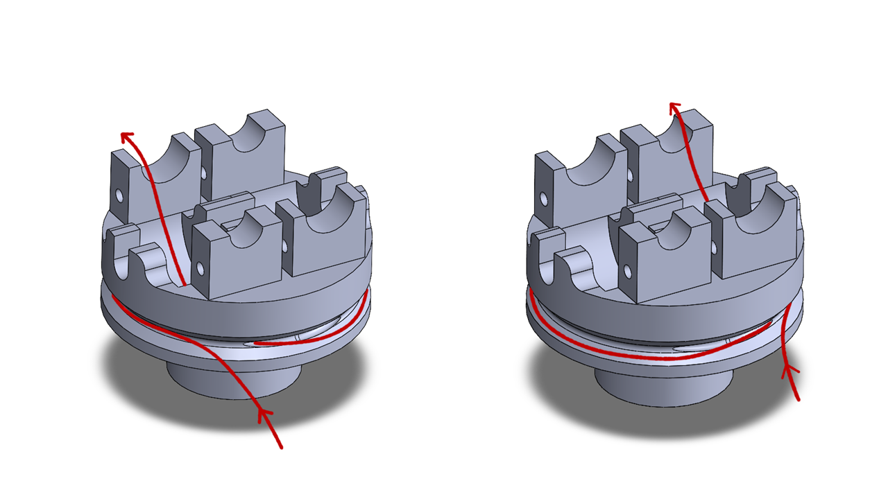{width=80% .center}

Once the cables have been wound around the pulley, they are attached to the star wheel as shown below, finishing with a double knot large enough to prevent the cable from coming undone when tension is applied. Finally, the star wheel is turned in the indicated direction to wind the remaining cable around it.

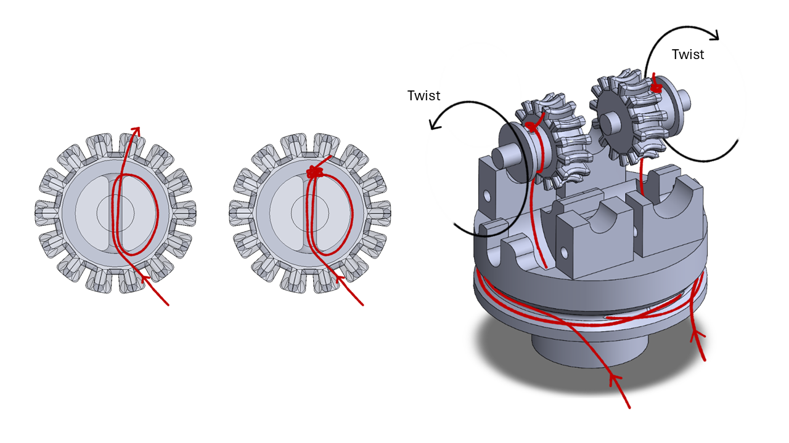{width=90% .center}

!!! info

    The winding direction ensures that tightening the screw increases the cable tension, while loosening it decreases the tension, rather than the opposite.
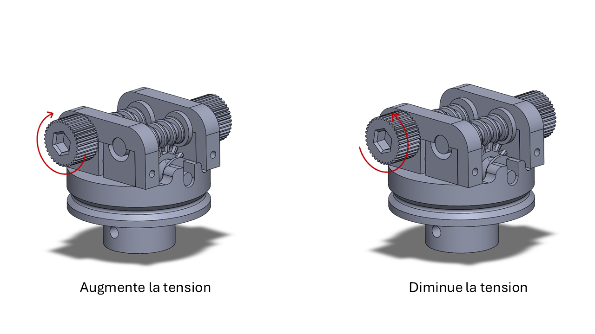{width=80% .center}
Finally, we position the screws and attach the covers over them. The screws are then adjusted so that all the cables are properly tensioned. This ensures that the prosthesis starts moving as soon as the motor rotates, without any noticeable delay.
