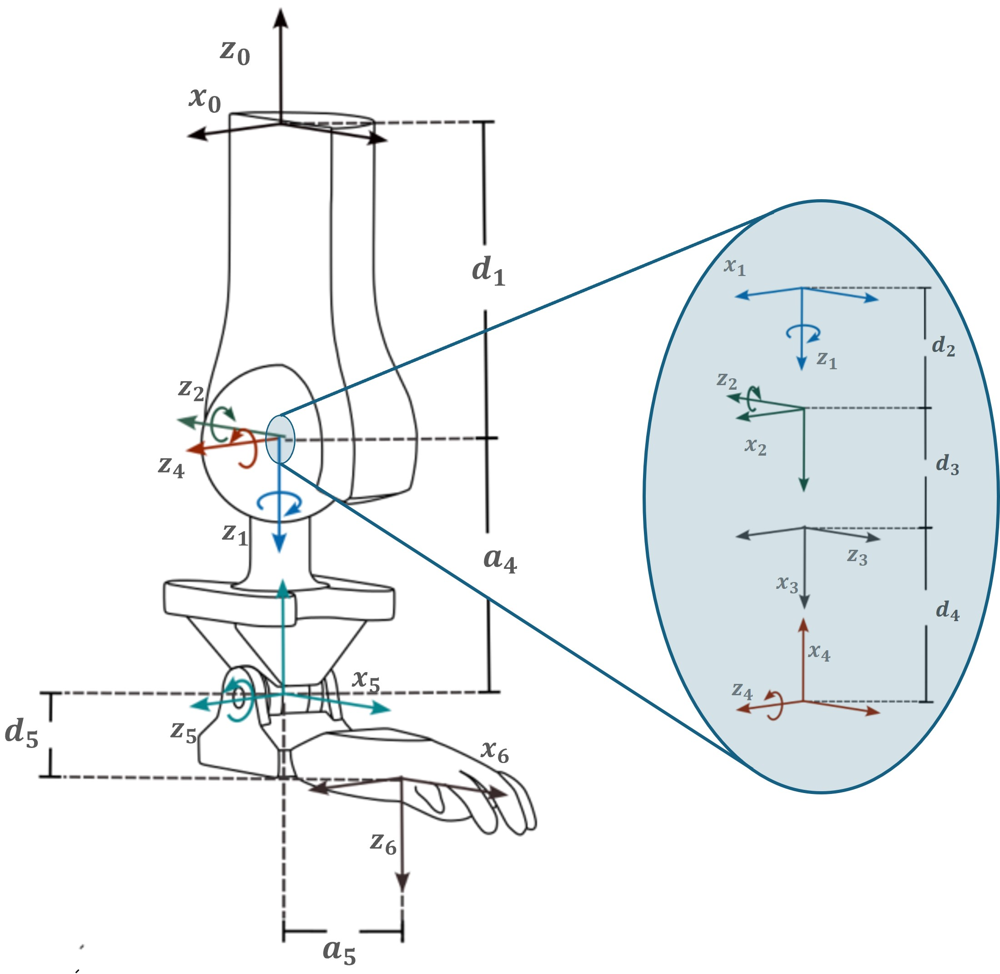
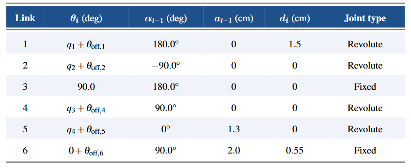

# Control 

## Modified denavit hartenberg 

Twist angle $\alpha_{i-1}$ is the angle between $z_{i-1}$ to $z_i$ measured about $x_{i-1}$

Link length $a_{i-1}$ is the distance from $z_{i-1}$ to $z_i$ measured along $x_{i-1}$

Offset length $d_{i-1}$ is the distance from $x_{i-1}$ to $x_i$ measured along $z_i$

Joint anglze $\theta_i$ is the angle between $x_{i-1}$ to $x_i$ measured about $z_i$

The system 3 is a supplementary system to add rotations to the spherical joint. This allows to respect DH restrictions,
such as $\forall x$, $x_i$ $\perp$ $z_{i+1}$ . It acts as a fixed joint between system 2 and system 4.

{width=500 .center}
{width .center}

\[
{}^{i-1}T_i =
\begin{bmatrix}
\cos\theta_i & -\sin\theta_i & 0 & a_{i-1} \\
\sin\theta_i\cos\alpha_{i-1} & \cos\theta_i\cos\alpha_{i-1} & -\sin\alpha_{i-1} & -d_i\sin\alpha_{i-1} \\
\sin\theta_i\sin\alpha_{i-1} & \cos\theta_i\sin\alpha_{i-1} & \cos\alpha_{i-1} & d_i\cos\alpha_{i-1} \\
0 & 0 & 0 & 1
\end{bmatrix}
\]

## Inverse Kinematics via DLS with Null Space 

### Damped Least Squares (DLS) Pseudoinverse

### Null space
Secondary Task: Joint Limit Avoidance
Cost Function: Distance to Joint Center

## control architecture

### PID

### Sigmoid 