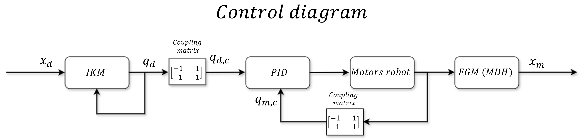
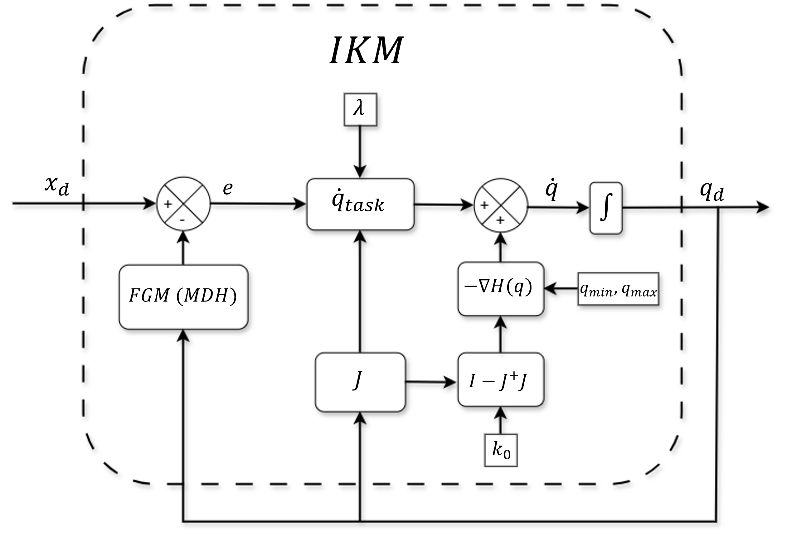
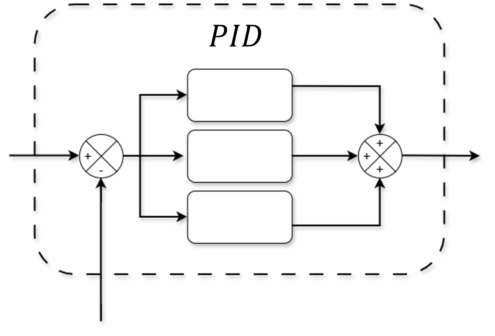

 
# Control Architecture

{width=100% .center}

## Inverse Kinematics via DLS with Null Space 
{width=80% .center}

### Damped Least Squares (DLS) Pseudoinverse

### Null space
Secondary Task: Joint Limit Avoidance
Cost Function: Distance to Joint Center

### PID
{width=80% .center}
### Sigmoid 
