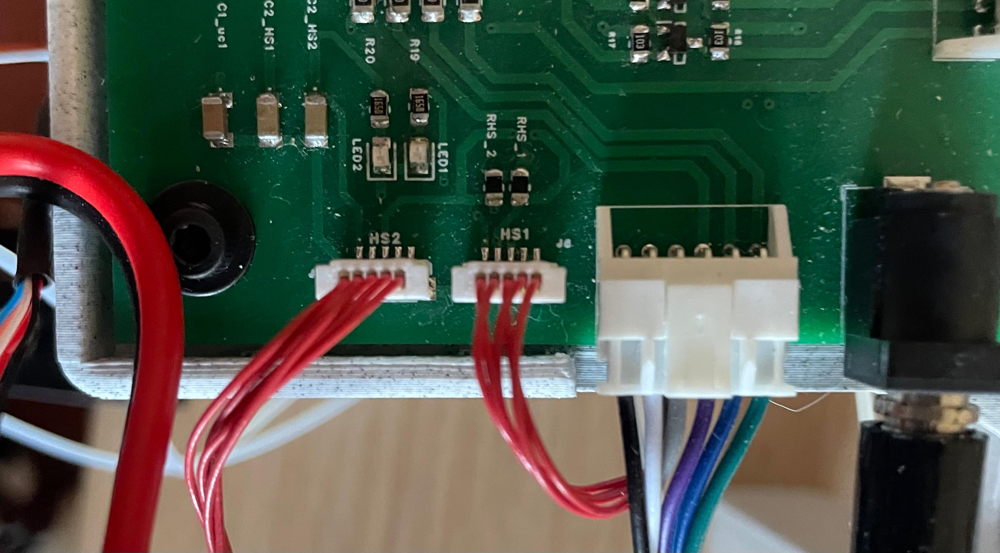

La prothèse utilise la carte Arduino Teensy, qui permet de (commander les drivers?). La Teensy est fixée sur une carte avec plusieurs connecteurs, permettant de la relier avec les cartes de connexions entre les drivers....

## Schéma électronique
{width=200% .center}
## Boards
The prosthesis uses four boards: the Teensy, which is mounted on a larger Promice board, as well as two connection boards between the drivers.

{width=100% .center}

## Câblage
### Connectors
To prepare the connectors, we need one set of eight cables and one set of six cables. We cut the cables to a length of approximately 30 cm. The ends of the cables are then stripped to allow the crimp terminals to be attached, making it possible to insert the cables into their respective connectors.
!!! note
   The wiring of these connectors is shown in blue in the electrical schematic.
{width=100% .center} 

### Jack connectors
We also need three jack connectors, with cables approximately 30 cm long. One cable is soldered to the longer metal section, which corresponds to the outer contact of the jack, while the other cable is soldered to the shorter metal section, which corresponds to the inner contact of the jack. We then heat the sleeve, which was previously slid over the cable, around the stripped section of the longer cable to ensure that the two cables do not come into contact. 
The jack can then be screwed back together, and a continuity test can be performed to ensure that there are no false contacts. This also allows us to identify which cable is soldered to the longer section and which is soldered to the shorter section at the other end.
!!! note
    The wiring of these connectors is shown in gray in the electrical schematic.
{width=70% .center} 

### Sensor connectors
Finally, we extend the cables coming from the two sensors by soldering an additional cable to each of the existing cables. A sleeve is then placed over each soldered connection and heat-shrunk to secure and insulate the connection.

{width=100% .center} 

We then attach the crimp terminals and insert the cables into their respective connectors, making sure that the sensor PINs match the markings on the board. The socket sensor is connected to HS1, while the limb sensor is connected to HS2.

{width=100% .center}
!!! note
    The sensor wiring is shown in red in the schematic.

### Câblage entre les drivers
We first connect the power supplies of drivers 1, 2, and 3 to the board of driver 1. The power supply of driver 4 is connected to the board mounted on top of it.
Then, using standard male-to-male jumper wires approximately 25 cm long, we connect the TX/RX ports of drivers 2 and 3 to the RX/TX ports of the board of driver 1, respectively.

!!! note
    The power connections are shown in black and red in the schematic, while the RX/TX connections are shown in green and yellow.

The location of the TX and RX ports on the drivers is indicated in the [datasheet](https://ustepper.com/productsheets/Product_sheet_S32.pdf).
