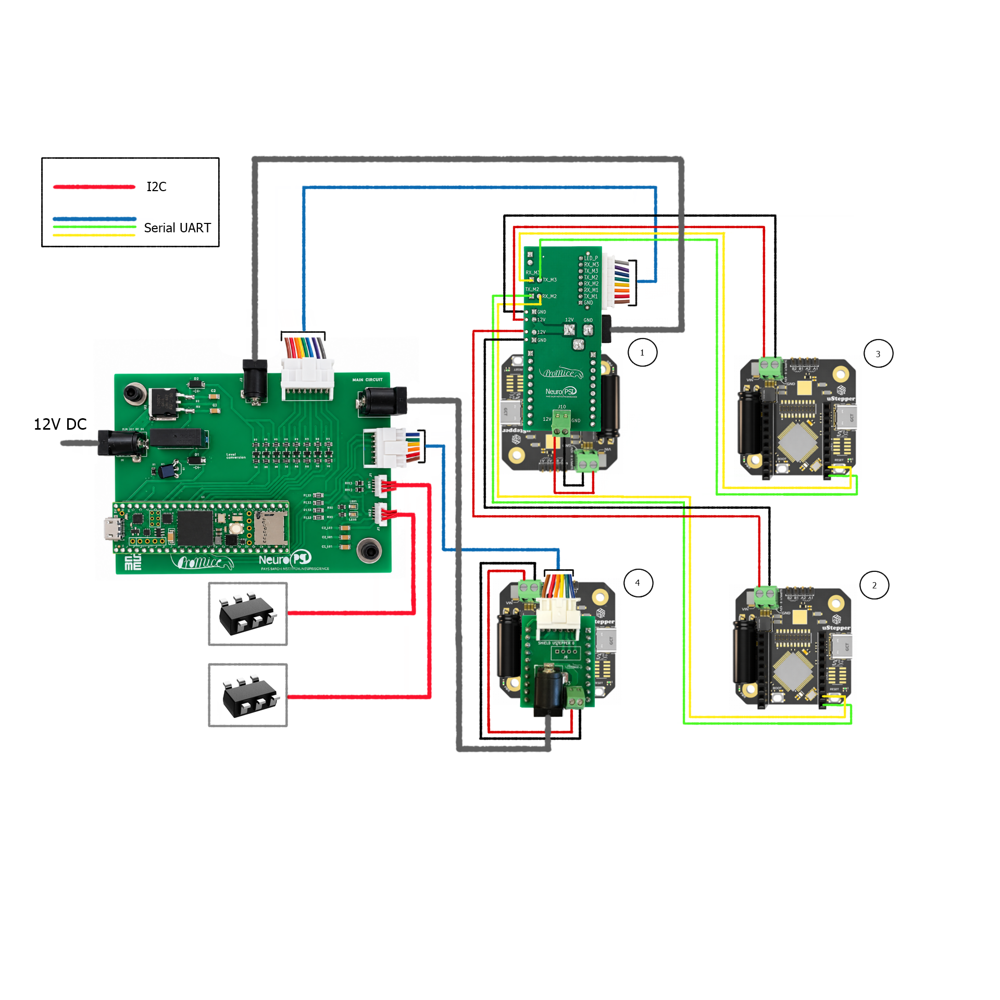
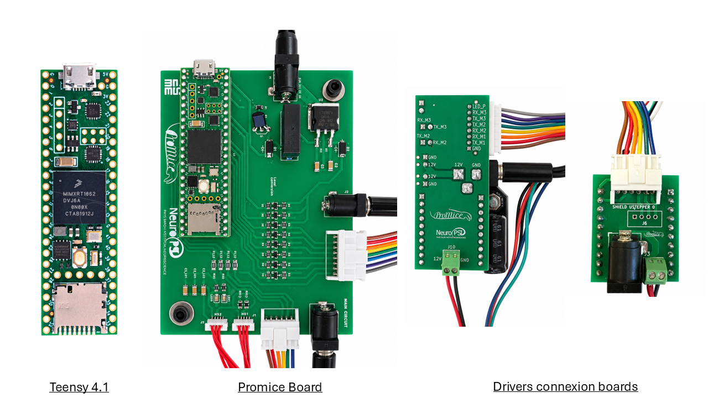
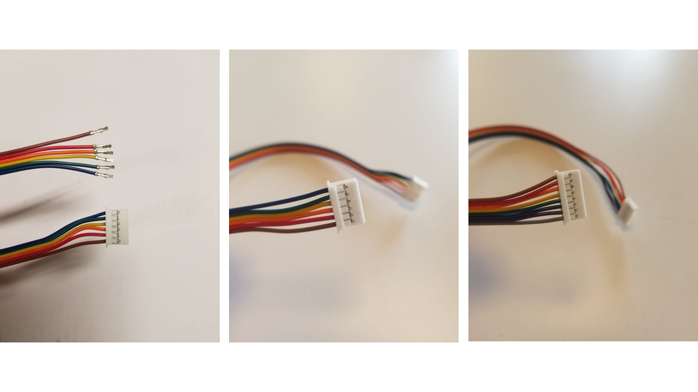
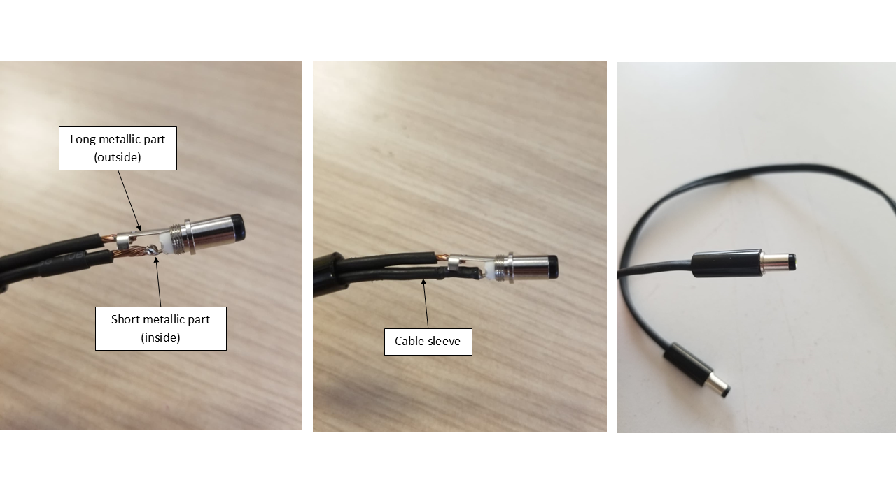
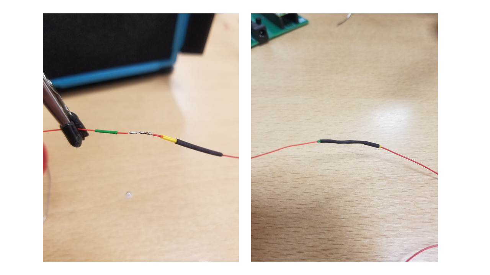

La prothèse utilise la carte Arduino Teensy, qui permet de (commander les drivers?). La Teensy est fixée sur une carte avec plusieurs connecteurs, permettant de la relier avec les cartes de connexions entre les drivers....

## Schéma électronique
{width=200% .center}
## Boards
La prothèse utilise 4 boards : La Teensy, qui est montée sur une plus grande board Promice, ainsi que 2 cartes de connexion entre les drivers.

{width=100% .center}

## Câblage
### Connectors
Pour préparer les connecteurs, il nous faut un set de 8 et un set de 6 câbles. On coupe une longueure d'environ 30cm. On dénude ensuite les câbles sur leurs extrémités pour pouvoir positionner les cosses à sertir, ce qui permet d'insérer les câbles dans le connecteur respectif.
Le câblage de ces connecteurs est indiqué en bleu sur le schéma éléctronique.
{width=100% .center} 

### Jack connectors
Nous avons aussi besoin de 3 prises jack, avec une longueure de câble d'environ 30 cm aussi. On vient souder un câble sur la partie métallique longue, qui correspond à l'extérieur de la prise jack et l'autre câble sur la partie métallique courte, qui correspond à l'intérieur de a prise jack. On cauffe la gaine (que l'on a glissée auparavant) sur la partie dénudée du câble long pour s'assurer que les 2 câbles ne soient pas en contact.

image avant gaine et apres gaine

On peut ensuite revisser la prise et tester la continuité pour s'assurer qu'il n'y ait pas de faux contact et identifier le câble à souder sur la partie longue ainsi que celui à souder sur la partie courte de l'autre côté.
Le câblage de ces connecteurs est indiqué en  gris sur le schéma éléctronique.

{width=100% .center} 

### Sensor connectors
Enfin, on rallonge les câbles issus des 2 capteurs en venant souder un autre câble sur chacun des câbles déjà présents. On enfile et on chauffe une gaine au niveau de la soudure pour solidifier le tout.

{width=100% .center} 

 On ajoute les cosses à sertir et on enfile les câbles dans leur connecteur, en s'assurant de faire correspondre les PIN du capteurs avec les indications sur la carte.

IMAGE connecteurs

### Câblage entre les drivers
On commence par relier les alimentations (en  noir et  rouge sur le schéma) des drivers 1, 2 et 3 à la board du driver 1. L'alimentation du driver 4 est reliée à la board qui est insérée dessus.
Ensuite, à l'aide de câbles mâle-mâle classique d'environ 25 centimètres, on connecte respectivement les ports TX/RX des drivers 2 et 3 aux ports RX/TX de la board du driver 1 (en  vert  et  jaune  sur le schéma).
L'emplacement des ports TX et RX des drivers sont indiqués dans la [datasheet](https://ustepper.com/productsheets/Product_sheet_S32.pdf).
