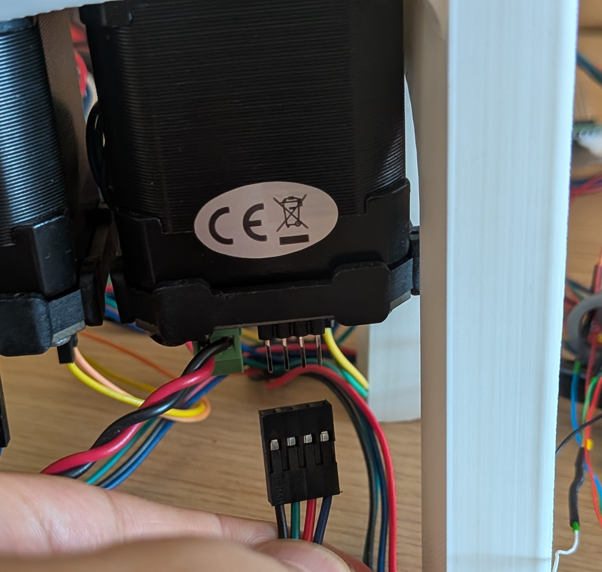

# Encoders linearization 

Just before start the linearization unplog your motor from the Ustepper driver so you can move it with your hand.
Once you have found all setting values plug it in again. 
{ width=38% .center }
