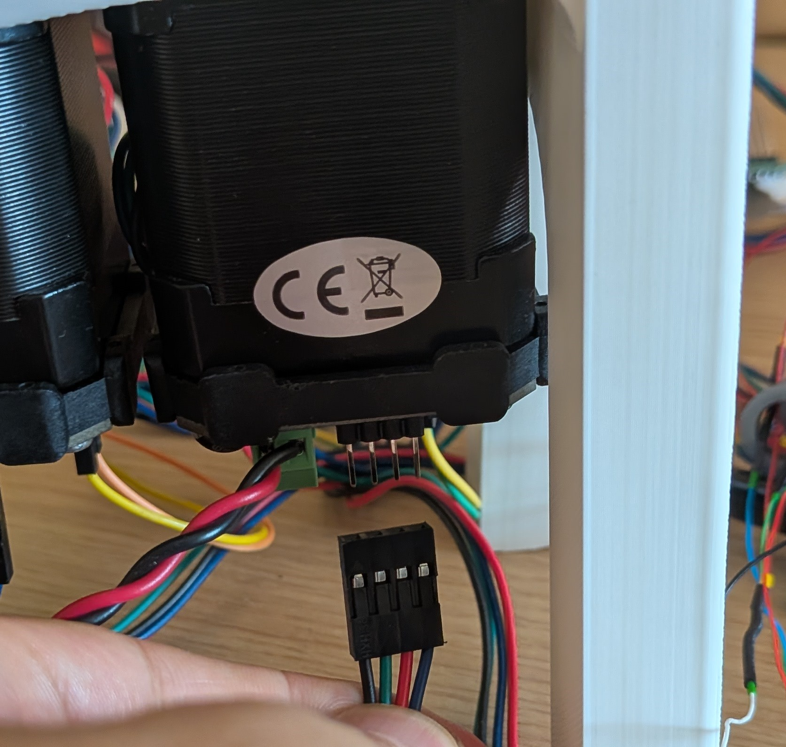

# Encoders linearization 

Just before start the linearization unplog your motor from the Ustepper driver so you can move it with your hand.
Once you have found all setting values plug it in again. 
{ width=38% .center }

!!! warning
    Verify the size of the table $Nx$ if you redo a linearization, since a new linearization can produce a different size of table.

    ``` c
    static const int Nx = 80;
    ```
    
