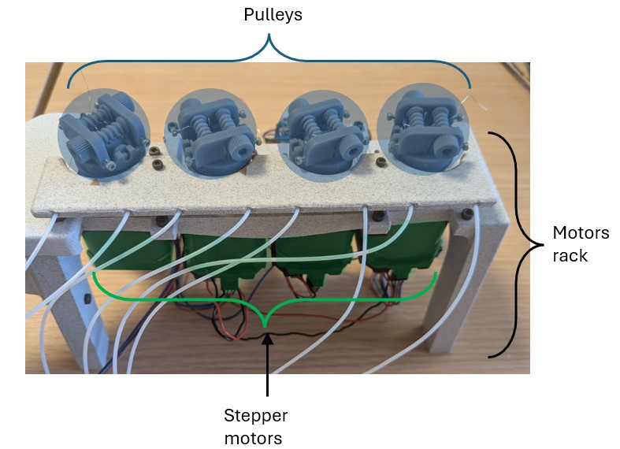
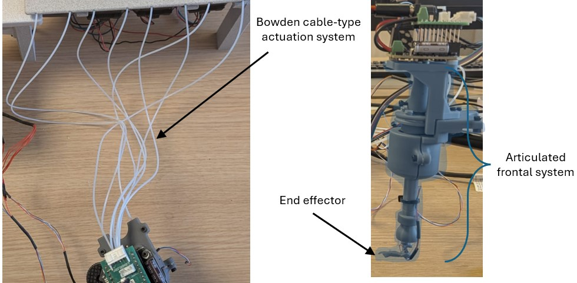
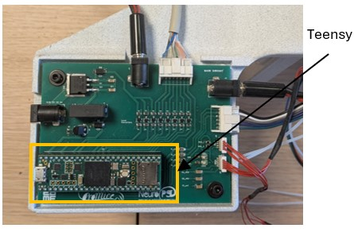
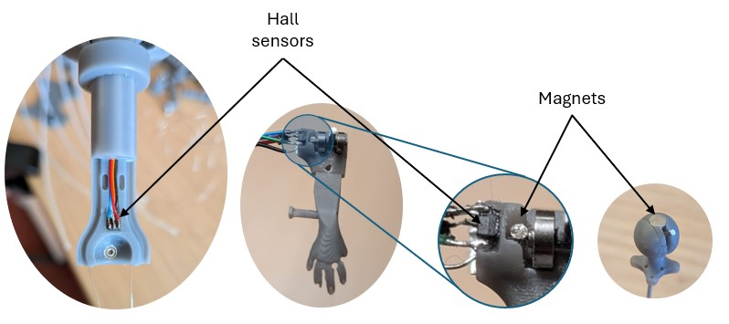
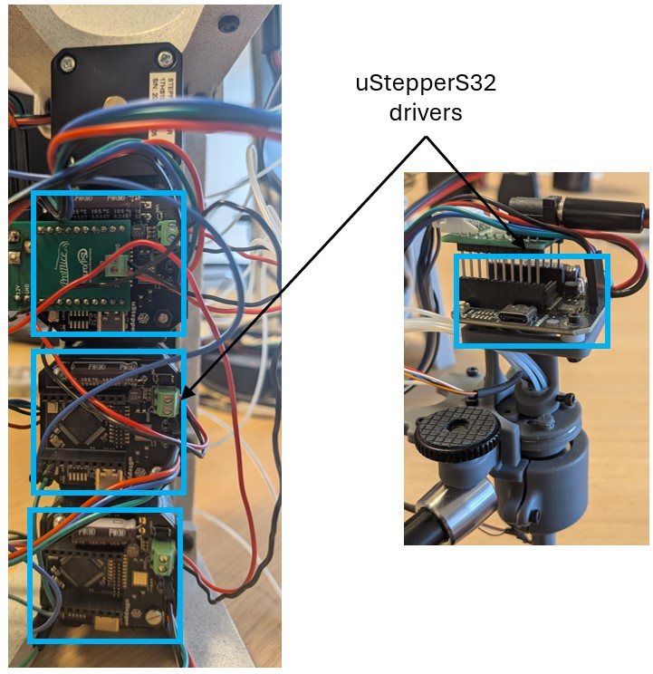

{ width=70% .center}

{ width=70% .center}

{ width=50% .center}

{ width=50% .center}

{ width=50% .center}

The precision of the prosthesis movement is achieved through stepper motors equipped with controllers and Hall sensors.
This allows for rotations of much less than 1 degree and a high sampling rate for the angular position of the actuators

show the cable driven sistem
