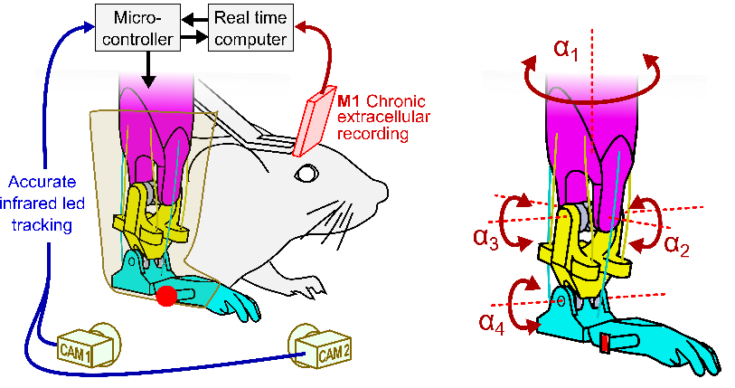
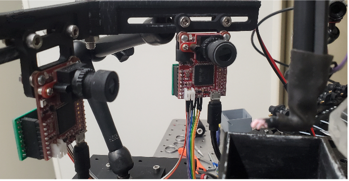
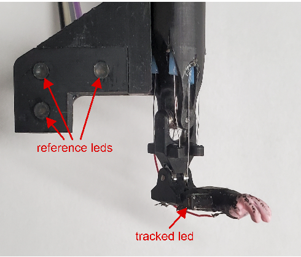
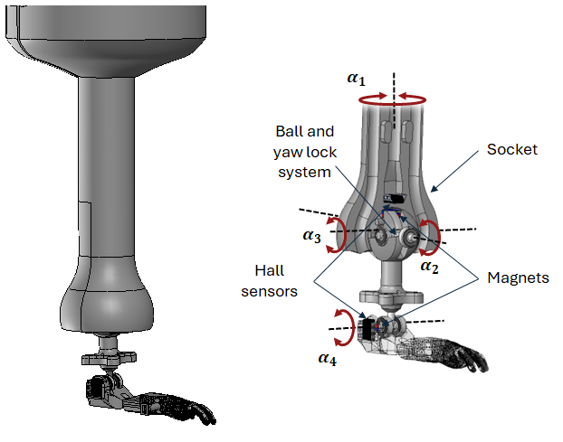

# ProMice from HERMIN project
---------------TEST------------------,Another test_______________
Haptic Exploration and Reflex Motor control In a Neuroprosthesis :
Project HERMIN aims to develop and explore for the first time 
adaptive shared-control strategy in a bidirectional neuroprosthesis with direct sensory feedback 
from the prosthesis to the cerebral cortex. To achieve this goal, researcher [Luc Estebanez](https://neuropsi.cnrs.fr/annuaire/luc-estebanez/) and 
his team at  Paris - Saclay Neuro Sciences Institute; [NeuroPsi](https://neuropsi.cnrs.fr/), have developed ProMice, a miniaturised mouse forelimb prosthesis with 4 degrees-of-freedom.
## ProMice Prosthesis

{id="mouse_leg" width=70% .center }

The prosthesis implements a motion-tracking system that relies on cameras and an infrared IR LED markers.
A microcontroller triangulates the 3D position based on data from the cameras and performs position control.

{ width=70% .center }

Both cameras are positioned on the side of the prosthesis at a fixed distance from the LEDs and at a fixed angle to each other. The position of the leg's LED is determined by
triangulation, using one camera as a reference relative to the other.

{ width=50% .center}

The prosthesis has three more IR LEDs to create a virtual reference space.

## ProMice - Instrumented version
Camera-based motion tracking presented certain limitations. If the IR LED moves out of the camera's framing, the position
of the prosthesis is lost. The tracking system is also susceptible to positional disturbances or misalignment, making it necessary to
perform a recalibration, which takes a considerable amount of time. Another consideration is the space occupied by the system. During experiments,
extreme care is required to avoid touching the cameras and accidentally misplacing them.

Researchers of ESME Research lab, [Alex Caldas](https://www.esme.fr/recherche/chercheur/alex-caldas/) and [Juan Carlos Martinez](https://www.esme.fr/recherche/chercheur/juan-carlos-martinez-rochas/)
have colaborated to the project to develope new version of ProMice. It primarily addresses the limitations of camera-based motion tracking systems.
This new version uses 3D Hall effect sensors embedded in the prosthesis joints to measure its position locally.

{ width=60% .center }

To adapt the sensors to the prosthesis, a ball-and-socket joint was designed that moves in two degrees of freedom
($a_2$ and $a_3$) and features an internal ball bearing system to prevent rotation about its own axis, 
since this rotation is already accounted for by $a_1$. The Hall effect sensor in the ball-and-socket joint measures $a_2$ and $a_3$, 
while a second Hall sensor measures the rotation of $a_4$ .

