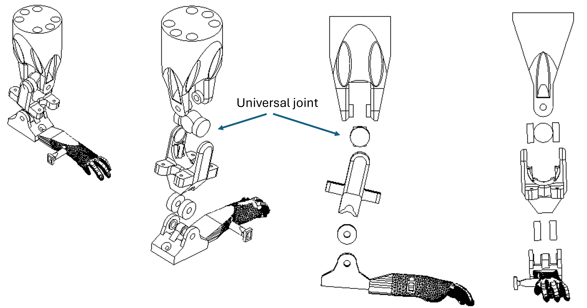
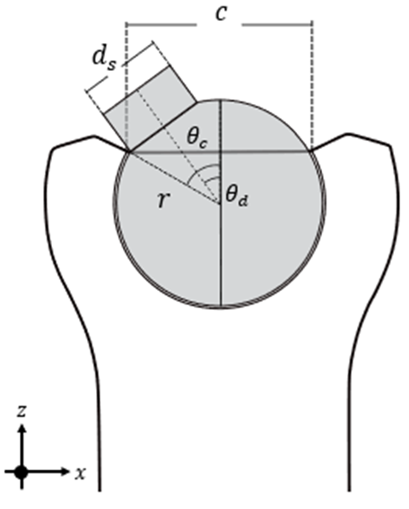
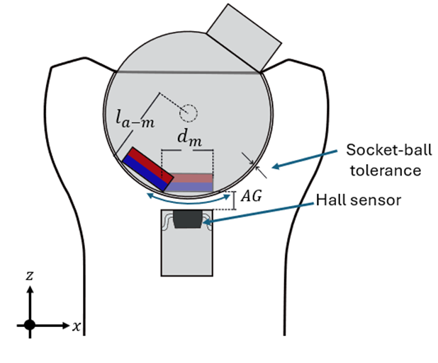
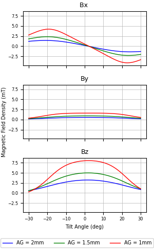
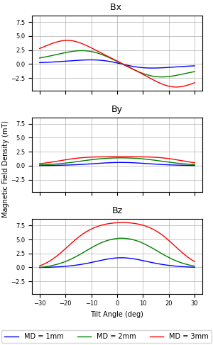
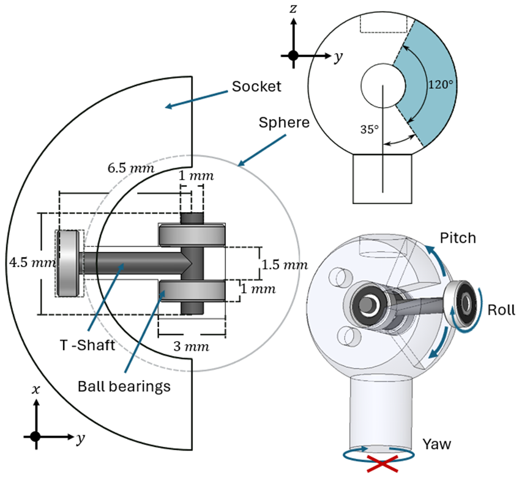


## Shoulder ball-joint-type 
[ProMice prosthesis](index.md#mouse_leg) shoulder is a 3DOF joint from which only $\alpha_1$ is measured.
 $\alpha_2$ and $\alpha_2$ are degrees of freedom coupled by a universal joint. 
 
{ width=80% .center }

This is a system difficult to instrument if we want to measure the angles. Choosing from the typical encoding 
techniques would mean to instal a sensor on each axe, like a pottentiometer, an optical encoder or a hall sensor for example. 
Cependant il existe des capteurs à effet Hall qui mesurent les composantes x,y et z du champ magnétique. Cette caractéristique 
permet d'estimer la position d'un aimant qui pend face au capteur, notamment les rotations ortogonales à l'axe z du capteur. 
En partant de cette idée, nous avons decidé d'implementer un configuration de joint de type rotule (socket-ball) en integrant le capteur Hall 3D 
à l'intérieur de la coque qui maintient la rotule. Dans la section [Sensors](sensors.md), vous pouvez trouver plus de détails sur 
l'utilization du capteur, tels le numéro de composant, les types de données, le calcul des angles, connexions capteur - micro, etc. 

Pour élaborer une telle articulation nous avons dû considerer, avant tout, la taille de l'ancienne version de ProMice ansi que celle
du capteur. Ces deux contraintes nous ont conduits au choix de dimensions suivants. 
## Ball joint design
### Ampitud of movement of ball joint
Pour la conception, il a été necessaire d'imprimer une sphère avec une tige attachée et une coque. Nous avons fait une série d'iterations
d'impersion 3D pour déterminer quelle pouvait être une taille raisonable en respectant les contraintes mentionées. 
Vues les limites de l'impresion 3D en resine remarquées sur la surface spherique de la boule ansi que celle à l'intérieur de la coque, 
nous avons choisi un diamètre de $8$ $mm$ pour la sphère et de $3$ $mm$ pour la tige. Il est important de considèrer une tolerance d'une pièce 
par rapport a l'autre. Dans notre cas, il y a un écart de 0.04 mm entre le diemètre de la sphère et celui de lintérierur de la coque.
Cette tolérance fonction aussi pour les trous. 

El parametro mas importante al momento de disenar el socket que contiene la bola es la amplitud de movimiento
que esta va a permitir. Tambien realizamos alguna simulaciones para ver la atenuacion del campo magnetico segun 
la inclinacion de la torula. por lo tanto

{ width=38% .center }

\begin{equation} \label{eq:theta_chord}
    \theta_c = arcsin(\frac{d_s}{2r})+\theta_d
\end{equation}

\begin{equation} \label{eq:chord}
    c = 2*r*sin(\theta_c)
\end{equation}

To chose the size of the magnet and the magnet-sensor gap. [Hall sensor simulation](sensors.md#sensor-simulations)

{ width=55% .center}

\begin{equation} \label{eq:AG}
    AG_{min} = l_{a-m}\left(\sqrt{1+(\frac{d_m}{l_{a-m}})^2}-1\right)
\end{equation} 

{width=47% align=left}
{ width=47% align=right}

|  Ball joint design parameters  |                 |
|:------------------------------:|:-------------:  |
| Ball radius                    | $r$ = 4 𝑚𝑚        |
| Amplitude of movement          | $𝛼_{2,3}$ = ±35°|
| Magnet diameter                | $𝑑_𝑚$ = 3 𝑚𝑚    |
| Magnet thikness                | $th_m$ = 1 𝑚𝑚
| Magnet-sensor gap              | 𝐴𝐺  = 1 𝑚𝑚      |
|Socket-ball tolerance           | $T$ = 0.02 𝑚𝑚   |
| Stick diameter                 | $𝑑_𝑠$ = 3 𝑚𝑚    |
|Socket chord                    | $c$ = 8 𝑚𝑚 |

Add formulas here

## Yaw-lock system

describe the yaw lock system

{id="yaw_lock_system" width=70% .center }

add an image of the ball joint 3D model