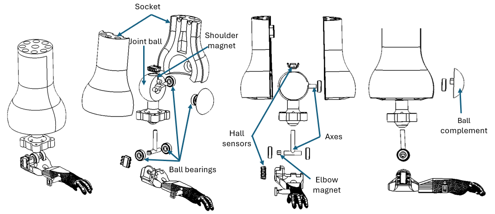
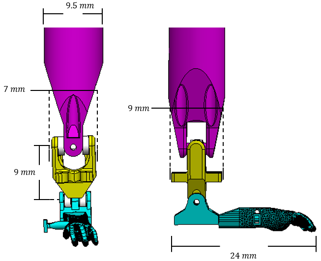
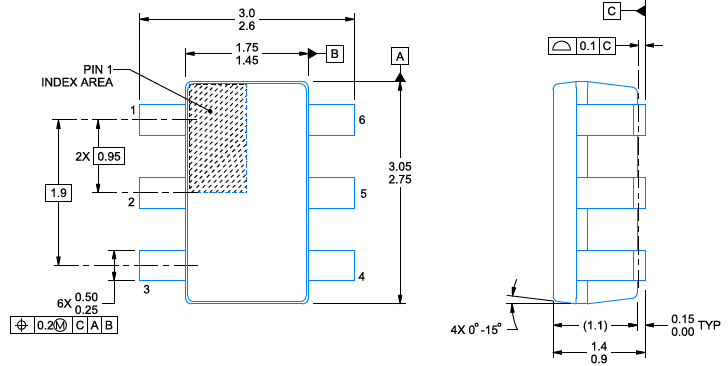
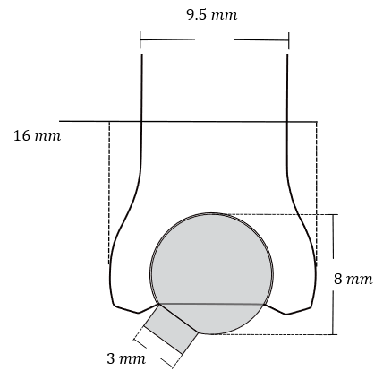
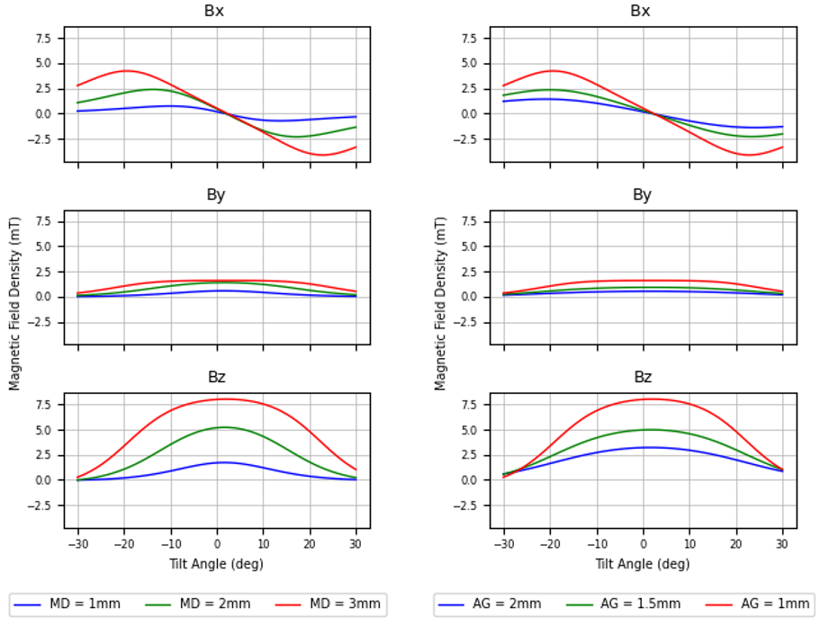
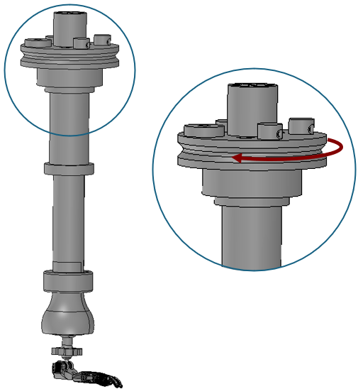
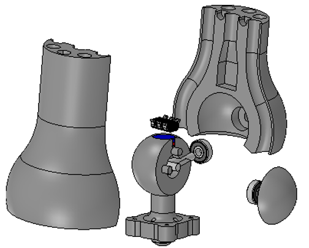



## Shoulder ball-joint-type 
[ProMice prosthesis](index.md#mouse_leg) shoulder is a 3DOF joint from which only $\alpha_1$ is measured.
 $\alpha_2$ and $\alpha_3$ are degrees of freedom coupled by a universal joint. 
 
{ width=80% .center }

The main enhancement ProMice need is to locally measure the angular joint positions for a better and easier control. From the typical encoding 
techniques it would mean to instal a sensor on each rotation axe, like a potentiometer, an optical encoder or a hall sensor for example.

Nevertheless, there are Hall-effect sensors that measure the x, y and z components of the magnetic field. This feature
makes it possible to estimate the 3D position of a magnet facing of the sensor. However, the current joint design results difficult to instrument. 
 
Building on this idea, we decided to replace the shoulder universal joint by an instrumented ball joint. It is a ball-socket configuration that integrates a 3D Hall sensor
inside the housing socket and a disc-type magnet inlaid in the ball. 

In addition to this, to make all joints instrumented, a second Hall sensor is integrated on the elbow axis. 

!!! info
    In the [Sensors](sensors.md) section, you can find further details on
    the use of the 3D Hall sensor, such as the component number, data types, angle calculations, sensor-microcontroller connections, etc. 

{ width=90% .center }

The dimensions of the new joint had to be as close as possible to the previous version ones, also a housing for the Hall sensor must fit inside.

{width=80% .center}

{width=80% . center}

!!! info
    Hall sensor dimentions are in mm.
    
## Ball joint design

The ball joint consists on a 3D printed a sphere with a rod attached and a socket. We carried out a series of iterations
of 3D printing to determine what would be a reasonable size whilst meeting the dimentions constraints.

The observed limitations of resin 3D printing on the spherical surface of the ball as well as on the inside of the socket, led to 
fixing a diameter of $8$ $mm$ for the ball and $3$ $mm$ for the stick.

{width=50% .center}

!!! info
    When designing assembly pieces for resin printing, it is important to allow for a tolerance between pieces.
    In our case, there is a difference of 0.04 mm between the diameter of the sphere and that of the inside of the socket.
    This tolerance also applies to the holes and pieces fitting inside others.

### Ampitud of movement of ball joint
After dimension constraints the most important parameter when designing the socket that holds the ball is the range of movement
it will allow. The following image shows motion range $\theta_d$ allowed by the sockets geometry. 

{ width=38% .center }

We calculated a desired range of motion $\theta_d$ by the following formulas: 

\begin{equation} \label{eq:theta_chord}
    \theta_c = arcsin(\frac{d_s}{2r})+\theta_d
\end{equation}

\begin{equation} \label{eq:chord}
    c = 2*r*sin(\theta_c)
\end{equation}

Next, we select the magnet dimensions and the sensor-magnet air gap. From the commercially available magnets wee took three different
sizes to experiment. All of them are disc-type magnets with axial magnetization and $1$ $mm$ thickness. Diameters were $1$, $2$ and $3$ $mm$.

{ width=55% .center}

The minimum sensor-magnet air gap has to be calculated in order to avoid colisions between them. 

\begin{equation} \label{eq:AG}
    AG_{min} = l_{a-m}\left(\sqrt{1+(\frac{d_m}{l_{a-m}})^2}-1\right)
\end{equation} 

To decide the most suitable magnet diameter and the magnet-sensor air gap, we have performed some [Hall sensor simulations](sensors.md#sensor-simulations). 
In the following plot, on the left you can see the magnet density vs tilt angle for the 3 available diameters. As expected, the largest magnet allows 
more tilt sensing, whereas the other two have an important magnetic density drop before the 30 degrees. Therefore we kept the largest magnet.

{width=95% .center}

The air gap simulation (shown on the right side) was performed using the chosen magnet (3 mm diameter). It is important to remark that the tilt pivots on the $y$ axis, meaning that there should not be 
magnetic density variations on this axis. However the $1$ $mm$ airgap causes variation on the $y$ axis. This is called cross measuring, and It is an intrinsic effect of the sensor's point measurement.
To avoid such effect as much as we can, the $1.5$ $mm$ air gap is the best option. 

The design dimensions of the ball joint are summarised in the following table.

|  Ball joint design parameters  |         Value        |
|:------------------------------:|:-------------:  |
| Ball radius                    | $r$ = 4 𝑚𝑚        |
| Amplitude of movement          | $𝛼_{2,3}$ = ±35°|
| Magnet diameter                | $𝑑_𝑚$ = 3 𝑚𝑚    |
| Magnet thikness                | $th_m$ = 1 𝑚𝑚
| Magnet-sensor gap              | 𝐴𝐺  = 1.5 𝑚𝑚      |
|Socket-ball tolerance           | $T$ = 0.02 𝑚𝑚   |
| Stick diameter                 | $𝑑_𝑠$ = 3 𝑚𝑚    |
|Socket chord                    | $c$ = 8 𝑚𝑚 |

## Yaw-lock system

The shoulder joint is a ball-and-socket joint in which rotation about the z-axis is transmitted via an upper pulley located above
the ball joint. This decoupling is necessary because it would be impossible to actuate the three degrees of freedom if they were coupled inside the current ball joint's design.

{width=60% .center}

Since we can rotate on Z by the upper pulley, the Z-axis rotation of the ball joint must be locked. This will eliminate undesired rotations on Z while actuating the joint. 
Therefore, the second major stage of the mechanical design consisted of a mechanism
that allows for only two degrees of freedom. This designing presented an interesting mechanical challenge. A 2DOF limitation rotation mechanism
had to be housed inside the ball joint; otherwise, the joint would take up too much space exceeding the constraint dimensions. The proposed solution is what we have called
the Yaw-lock system. It is a tiny mechanism consisting of three mini bearings and a T-shaped rotation shaft. It allows for
pitch and roll rotations (rotation around the $x$-axis and the $y$-axis) and can be fitted inside the ball of the joint.

{id="yaw_lock_system" width=70% .center }

The ball bearings have a $1$ $mm$ thickness, an inner diameter of $1$ $mm$ and an outer diameter of $3$ $mm$. The T-shaft was crafted using a steel rod and tin soldering. 

{width=50% .center}

!!! info
    The fabrication of the T-shaft is detailed in [Tutorial](3D_printing.md) -> [Soldering](soldering.md)
