[ProMice V1](index.md#ProMice_V1) control is done with a stereo-vision motion tracking system. Researchers have found limitations in this compound control system during experimenttations with the BCI and the mouse. It turned out to be sensitive to small cameras displacements and touch perturbations. Therefore, they concluded that an integrated sensor system for joint position measuring was necesary. 
In this section we presente the mechanical enhancements that gave place to [Promice V2](index.md#ProMice_V2). The major modifications have taken place in the last 3 joints : $\alpha_2$, $\alpha_3$ and $\alpha_4$.

Since [Promice V2](index.md#ProMice_V2) is an optimised version of [ProMice V1](index.md#ProMice_V1) that incorporaties instrumented joints, the modifications have to preserve its dimensions as closely as possible to those of [ProMice V1](index.md#ProMice_V1). 

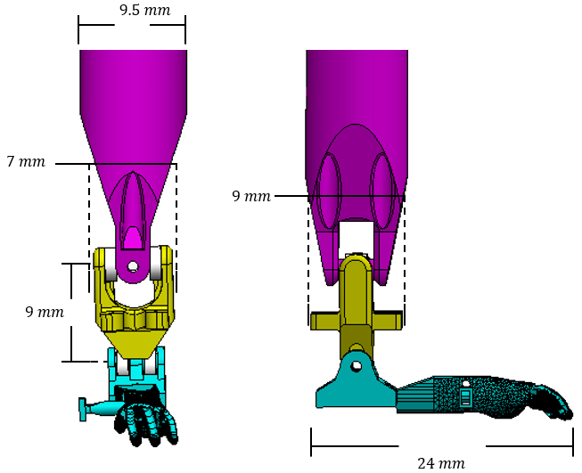{width=70% .center}

## Shoulder
The shoulder of [ProMice V1](index.md#ProMice_V1) is a 3DOF joint from which only $\alpha_1$ is measured. Degrees of freedom
$\alpha_2$ and $\alpha_3$ are coupled by a universal joint and they don't integrate sensors for joint position measuring. 
 
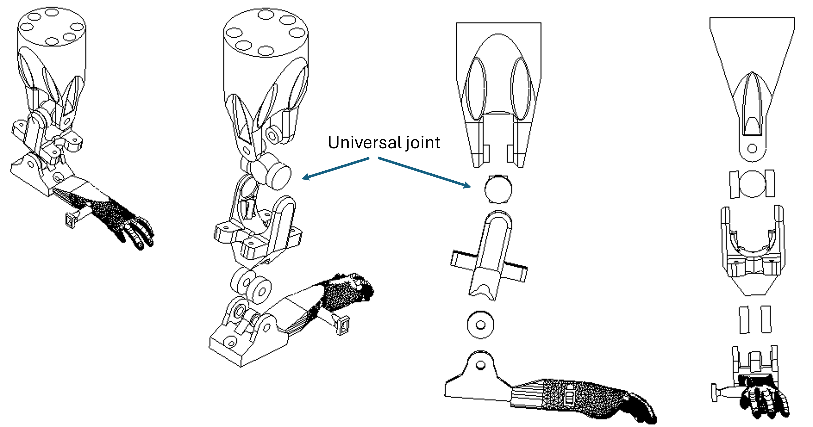{ width=80% .center .on-glb}

From the typical encoding techniques, to instrument the joints would mean to instal a sensor on each rotation axis, like a potentiometer, an optical encoder or a hall-effect sensor for example.
However, ProMice V1 joints design was not intended to host sensors. 

Among the different encoding devices, 3D hall-effect sensors stand out. They measure the $x$, $y$ and $z$ components of the magnetic fields. 

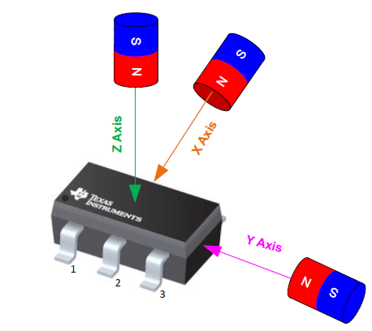{ width=25% .center} 

Since working with tiny robotic systems always falls into dimension constraints, space for sensors was a major limitation. 
3D hall-effect sensors make it possible to estimate the 3D position of a magnet facing of the sensor, wich means we can obtain the its orientation. 
Thus, we adopted the 3D hall-effect sensor as device to instrument the shoulder joint. The idea was to insert a magnet and use the orientation to indicate the joint positions $\alpha_2$ and $\alpha_3$. 

!!! info inline end 
    Hall sensor dimensions are in milimeters.
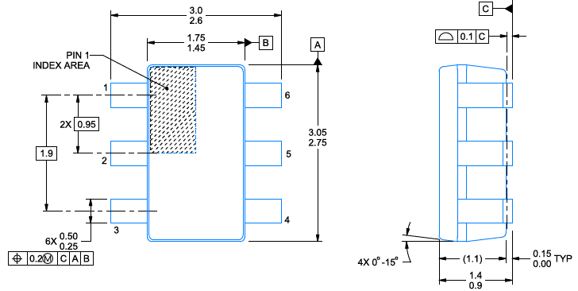{width=60% .center .on-glb}

## A new joint structure for ProMice
Because all joints must be instrumented, not only $\alpha_2$ and $\alpha_3$ but also $\alpha_4$ had to be redesigned. The shoulder universal joint ($\alpha_2$, $\alpha_3$) has been replaced by an instrumented ball joint. It is a ball-socket configuration that integrates the 3D hall-effect sensor inside the housing socket and a disc-type magnet inlaid in the ball. The last joint ($\alpha_3$ or elbow) is also instrumented with a hall sensor.

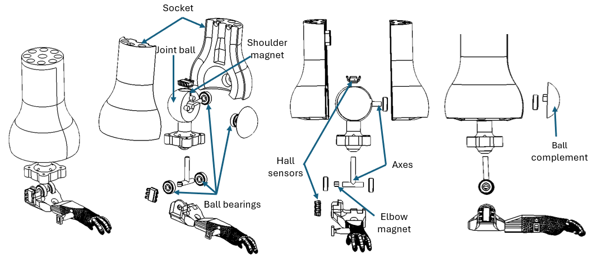{ width=90% .center .on-glb}
!!! info Sensors
    In the [Sensors](sensors.md) section, you can find further details on
    the use of the 3D hall-effect sensor, such as the component number, data types, angle calculations, sensor-microcontroller connections, etc. 

    
## Ball joint design

The ball joint consists on a 3D printed sphere with a stalk attached and a socket. We carried out a series of iterations
of 3D printing to determine what would be a reasonable size whilst meeting the dimentions constraints.

The observed limitations of resin 3D printing on the spherical surface of the ball as well as on the inside of the socket, led to 
fixing a diameter of $8$ $mm$ for the ball and $3$ $mm$ for the stick.

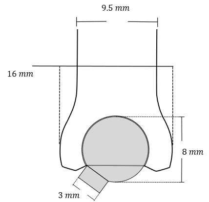{width=50% .center}

!!! note
    When designing assembly pieces for resin printing, it is important to allow for a tolerance between pieces.
    In our case, there is a difference of 0.04 mm between the diameter of the sphere and that of the inside of the socket.
    This tolerance also applies to the holes and pieces fitting inside others.

### Ampitude of movement of ball joint
After the dimension constraints impossed by the previous version of ProMice V1, the most important parameter when designing the socket that holds the ball is the range of movement
it will allow. The following image shows the motion range $\theta_d$ allowed by the sockets geometry. 

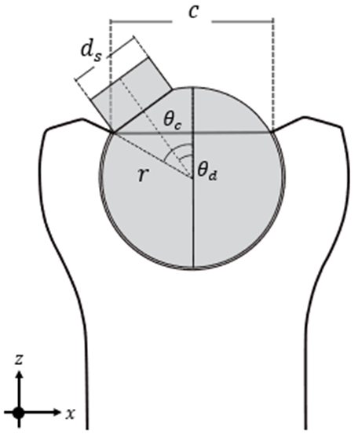{ width=38% .center }

We calculated a desired range of motion $\theta_d$ by the following formulas: 

\begin{equation} \label{eq:theta_chord}
    \theta_c = arcsin(\frac{d_s}{2r})+\theta_d
\end{equation}

Where $\theta_c$ is the angle that geometrically relates de thikness of the stick $d_s$ the bal radius $r$ and the desired amplitude of movement $\theta_d$ in degrees. 

Then : 

\begin{equation} \label{eq:chord}
    c = 2*r*sin(\theta_c)
\end{equation}

Where $c$ is the cord that cuts the circle of the socket allowing a maxmimum amplitud of movement $\theta_d$.

Next, we select the magnet dimensions and the sensor-magnet air gap. From the commercially available magnets wee took three different
sizes to experiment. All of them are disc-type magnets with axial magnetization and $1$ $mm$ thickness. Diameters were $1$, $2$ and $3$ $mm$.

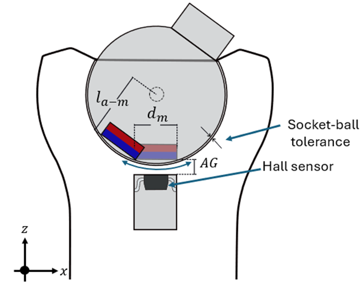{ width=55% .center}

The minimum sensor-magnet air gap has to be calculated in order to avoid colisions between them. 

\begin{equation} \label{eq:AG}
    AG_{min} = l_{a-m}\left(\sqrt{1+(\frac{d_m}{l_{a-m}})^2}-1\right)
\end{equation} 

Where $l_{a-m}$ is the anchor-magnet lenght and $d_m$ is the magnet diameter. 

To decide the most suitable magnet diameter and the magnet-sensor air gap, we have performed some [Hall sensor simulations](sensors.md#sensor-simulations). 
In the following plot, on the left you can see the magnet density vs tilt angle for the 3 available diameters. As expected, the largest magnet allows 
more tilt sensing, whereas the other two have an important magnetic density drop before the 30 degrees. Therefore we kept the largest magnet.

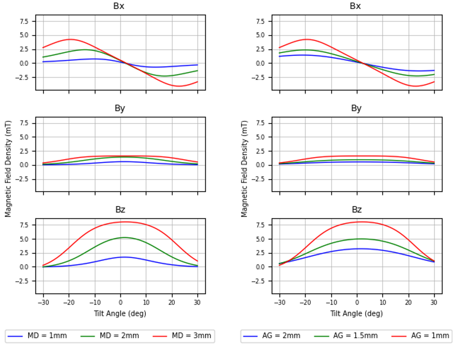{width=95% .center}

The air gap simulation (shown on the right side) was performed using the chosen magnet (3 mm diameter). It is important to remark that the tilt pivots on the $y$ axis, meaning that there should not be 
magnetic density variations on this axis. However the $1$ $mm$ airgap causes variation on the $y$ axis. This is called cross measuring, and It is an intrinsic effect of the sensor's point measurement.
To avoid such effect as much as we can, the $1.5$ $mm$ air gap is the best option. 

The design dimensions of the ball joint are summarised in the following table.

!!! table "Table 1: Ball joint design parameters"

    |  Parameters  |         Value        |
    |:------------------------------:|:-------------:  |
    | Ball radius                    | $r$ = 4 𝑚𝑚        |
    | Amplitude of movement          | $𝛼_{2,3}$ = ±35°|
    | Magnet diameter                | $𝑑_𝑚$ = 3 𝑚𝑚    |
    | Magnet thikness                | $th_m$ = 1 𝑚𝑚 |
    | Magnet-sensor gap              | 𝐴𝐺  = 1.5 𝑚𝑚      |
    |Socket-ball tolerance           | $T$ = 0.02 𝑚𝑚   |
    | Stick diameter                 | $𝑑_𝑠$ = 3 𝑚𝑚    |
    |Socket chord                    | $c$ = 8 𝑚𝑚 |

## Yaw-lock system 
### z-axis rotation
The shoulder is a 3 DOF joint in which rotation about the $z$-axis or $\alpha_1$ is transmitted via an upper pulley located above the ball joint as shown in the picture below. Rotation is measured with an encoder on the top of the pulley.
 

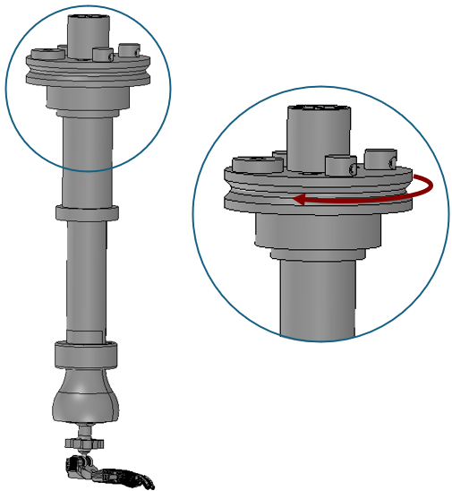{id="z_rotation" width=60% .center}

Since rotation about the $z$-axis is provided by the upper pulley, we only need a 2 DOF motion in the ball joint. Thus,  $z$-axis rotation of the ball joint respect to the socket must be locked. This prevents undesired yaw motion during joint actuation.

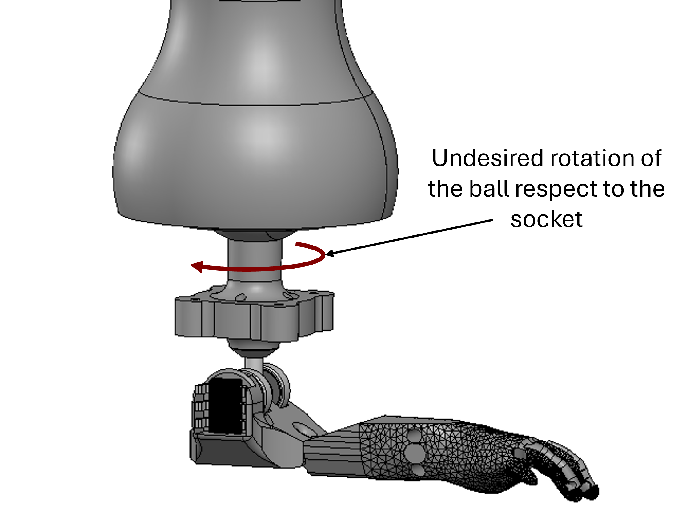{width=45% .center}

Consequently, the second major stage of the mechanical design focused on developing a mechanism that restricts the ball joint to two rotational degrees of freedom. This presented an interesting mechanical challenge: the rotation-lock mechanism had to be integrated inside the ball joint to avoid increasing its overall size beyond the dimensional constraints.

The proposed solution, referred to as the [Yaw-lock system](mechanical_design.md#yaw_lock_system), is a compact mechanism composed of three miniature bearings and a T-shaped rotational shaft. It allows the joint to perform pitch and roll rotations, corresponding to rotations about the $x$ and $y$ ($\alpha_2$ and $\alpha_3$) axes, respectively, while constraining rotation about the $z$-axis respect to the socket. The mechanism is designed to fit entirely within the ball of the joint, ensuring that the required range of motion is achieved without increasing the joint's external dimensions.

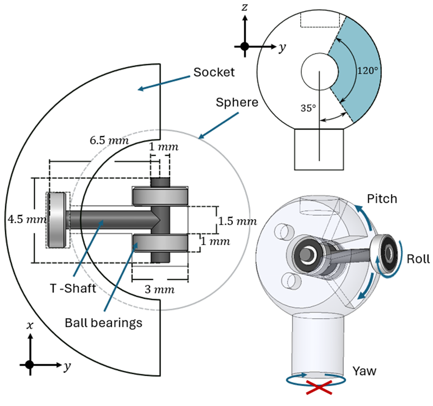{id="yaw_lock_system" width=70% .center }

The ball bearings have a $1$ $mm$ thickness, an inner diameter of $1$ $mm$ and an outer diameter of $3$ $mm$. The T-shaft was crafted using a steel rod and tin soldering. 

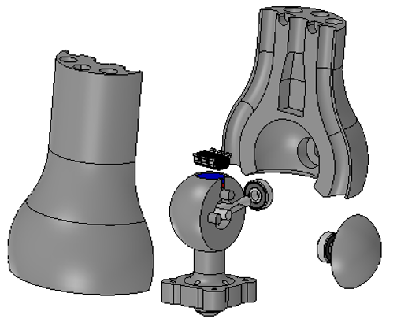{width=50% .center}

!!! info T-shaft
    The fabrication of the T-shaft is detailed in [Tutorial](3D_printing.md) -> [Soldering](soldering.md)
