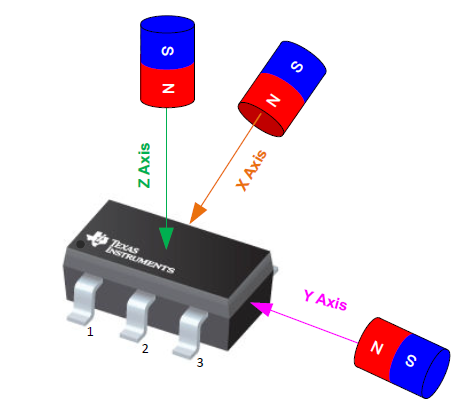
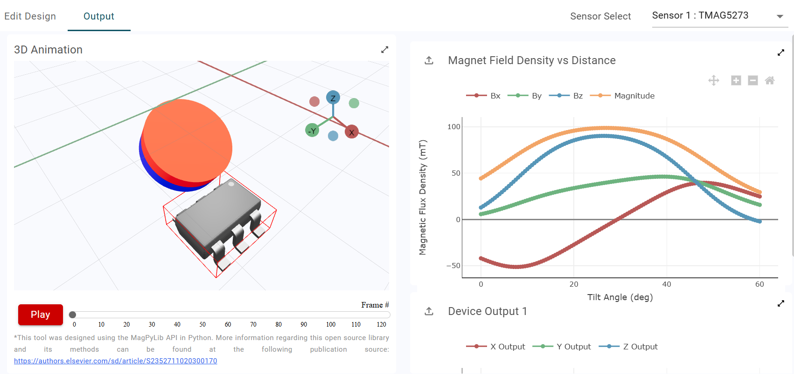
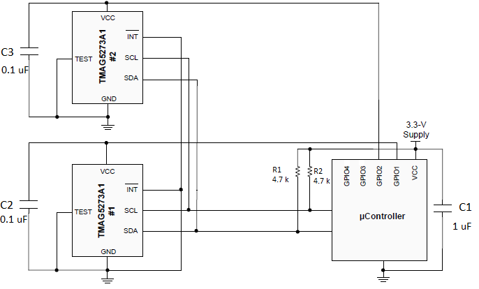
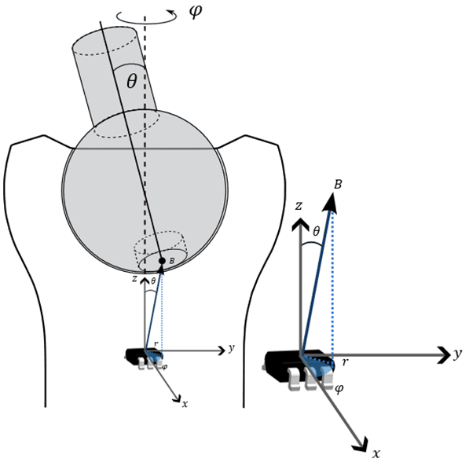

sensor [TMAG5273](https://www.ti.com/product/TMAG5273?qgpn=tmag5273)

{ width=40% .center } 

## Sensor simulations
Texas instruments has the [TI Magnetic Sense Simulator](https://webench.ti.com/), a useful tool to simulate different magnet movemenst with respect to 
the sensor. You can set the geometry of your magnet, the kind of movement (joystick in this case), the sensor you're using and some other functionalities.
 

{ width=100% .center }

The simulator uses [Magpylib package](https://www.sciencedirect.com/science/article/pii/S2352711020300170) to compute magnetic fields.
In section [Ball joint design](mechanical_design.md#ball-joint-design) We used Magpylib to simulate the magnetic field of a magnet of our choice. You can do interpolations to simulate different magnet-sensor gaps too.

The TMAG connection from [datasheet](https://www.ti.com/lit/ds/symlink/tmag5273.pdf?ts=1777974658121&ref_url=https%253A%252F%252Fwww.ti.com%252Fsitesearch%252Fde-de%252Fdocs%252Funiversalsearch.tsp%253FlangPref%253Dde-DE%2526nr%253D8%2526searchTerm%253DTMAG5273A1QDBVR)

{ width=70% .center }

{ width=40% .center } 

