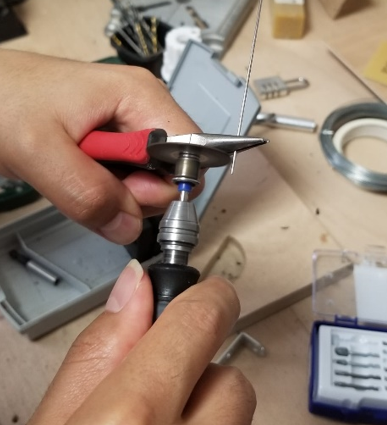
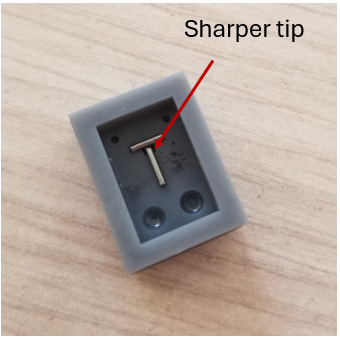
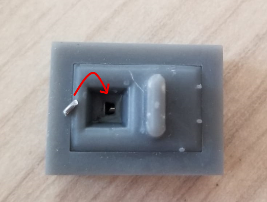
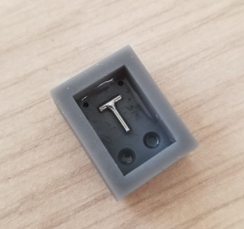
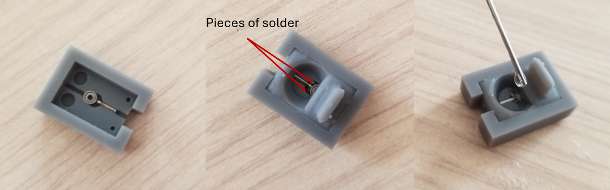

# Soldering 

The prosthesis uses small bearing and shaft systems in its joints $a_2$, $a_3$, and $a_4$. They consist of two small 
T-shaped shafts and four mini bearings. To build these systems, we must manufacture the T-shafts from 1-mm-diameter
steel rod using tin solder and phosphoric acid. Two of the four bearings have a pin soldered radially to them using 
the same technique as for the T-shafts. Soldering tiny steel parts is complicated using traditional techniques
However,  it is possible to solder steel with tin thanks to boric acid, because it removes or dissolves oxides from 
the surface and prevents new oxides from forming while the part is hot.
To solder these mini parts, we will use a standard soldering iron capable of reaching a temperature of 300 degrees and 
two resin-printed molds for the T-shaft and the mini bearings, respectively.

## T-shaft fabrication

The T-shaft consists of two segments, one 6 mm and the other 4.5 mm.

Include a diagram of the T-shaft with dimensions and two diagrams showing where they are used.

First, you need to cut the two segments using our rotary tool and a metal-cutting blade.

{width=40% .center}

You start with the smallest segment. To cut them precisely, we can cut the segment a little larger than needed and gradually wear it down; we use
our mold to measure after each step until it fits perfectly. One tip that will improve the fit is to leave the end of the
longer segment slightly tapered and position it so that it contacts the smaller segment. Then rotate it until both sides
are on the edges, somewhat as shown in the figure.

{width=40% .center}

Next, we add the part that covers the mold. The mold has a hole for inserting the soldering iron to solder both sides of the piece.
The hole is aligned with the joint, ensuring a precise solder joint. Next, we add a piece of solder
through the hole on the first side, then add at least two drops of phosphoric acid. We proceed to solder the first side
of the piece and repeat the process on the other side.

{width=40% .center}

anadir el cautin soldando imagen

The result looks like this: 

{width=40% .center}

## Elbow_ball bearings

The process is very similar: we place our pre-cut pin in the slot along with the bearing, add the mold insert, and then
add two pieces of tin-one in each cavity next to the bearing to solder the two corners of the pin, as shown in the image.
Finally, we add two drops of phosphoric acid and can begin soldering.

{width=90% .center}

add photo ball bearing soldering result