# Soldering 

The prosthesis relies on small bearing-shaft mechanisms to compose its joints $\alpha_2$, $\alpha_3$, and $\alpha_4$. They consist of two small T-shaped shafts and four mini bearings.

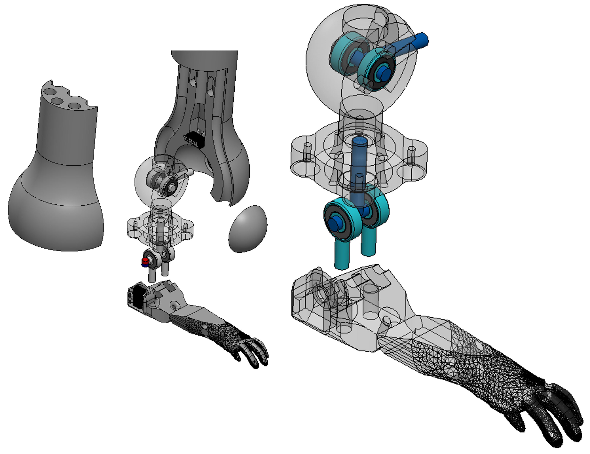{width=90% .center .on-glb}

T-shafts are crafted from 1-mm-diameter steel rod, soldered with tin solder. To join two pieces of steel with tin, we use phosphoric acid. Adding the acid right before soldering removes or dissolves oxides from 
the surface and prevents new oxides from forming while the part is hot. Like this, the tin will fuse with the steel rod surface.  The same technique works on the two bearings inserted in the elbow since they must have a pin soldered radially. To solder these mini parts, we used a standard soldering iron capable of reaching a temperature of 300 degrees.

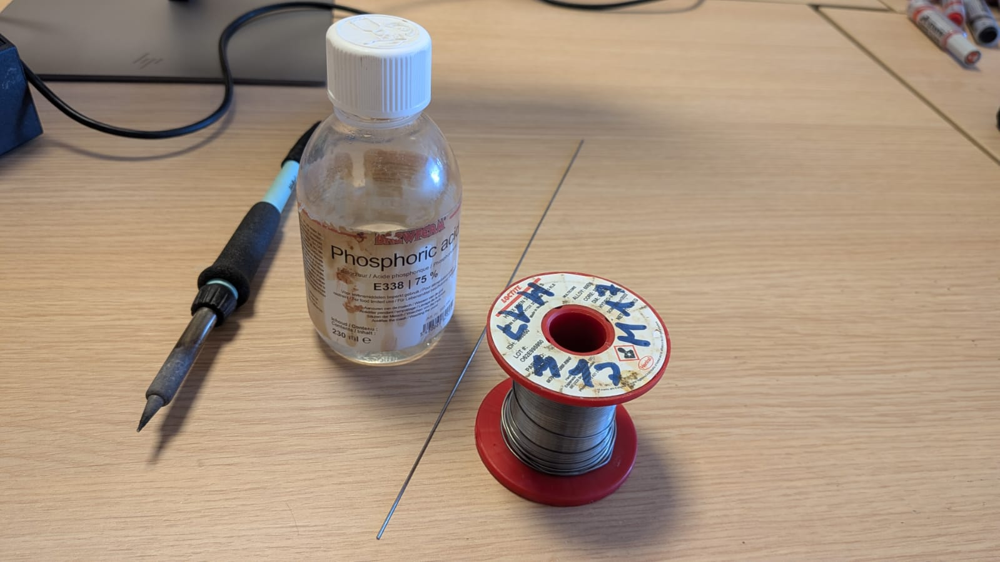{width=50% .center}

!!! tip
    The phosforic acid will abrade the soldering iron tip after several uses. We recomend that you use an old tip for this specific task and that you use a different tip for Electronic components soldering. 
    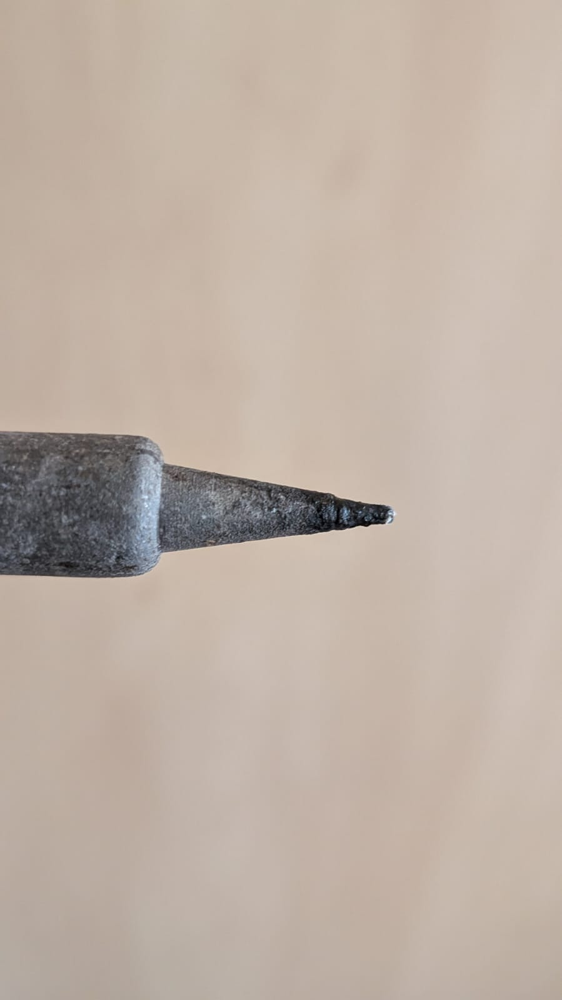{width=30% .center .on-glb}
    

To accurately form the soldered joints, we used the resin-printed molds shown below for the T-shaft and the mini bearings respectively.
!!! info inline end 
    You will find links to buy these materials in section [Materials](materials.md), as well as the molds' 3D

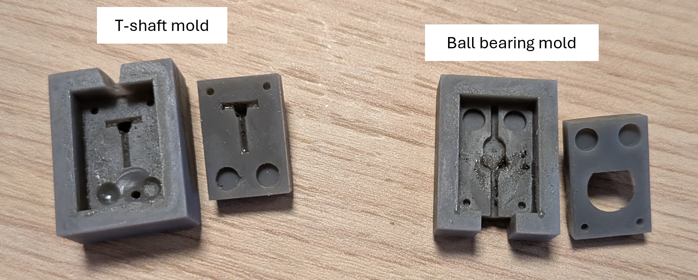{width=80% .center}

## T-shaft fabrication

To fabricate the T-shaft you need two segments; one of 6 mm and the other 4.5 mm lenght.

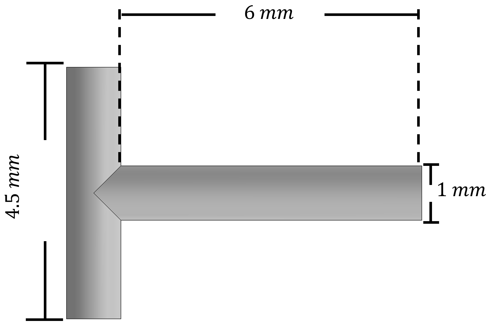{width=50% .center}

First, you need to cut the two segments using a rotary tool and a metal-cutting blade.

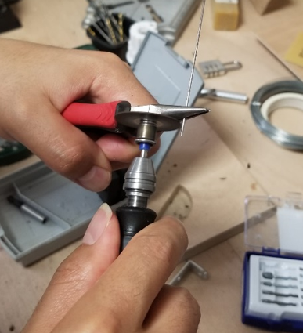{width=40% .center}

To cut them precisely, you can cut each segment a little larger than needed and gradually wear it down; use the mold to measure after each step until it fits perfectly. 

One tip that will help you make a good joint is to taper the end of the
longer segment slightly and position it so that it comes into contact with the shorter segment. Next, rotate it until the two small, worn sides of the longer segment are oriented to the sides, roughly as shown in the figure.

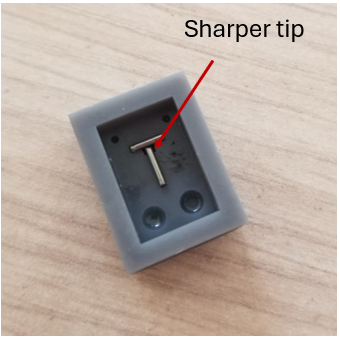{width=40% .center .on-glb}

Next, you add the mold lid. The mold and the lid have a hole for inserting the tin, the acid and the soldering iron to solder both sides of the piece.
The hole is aligned with the joint, ensuring a precise joint soldering.
Then you add a piece of solder through the hole on the first side and add at least two drops of phosphoric acid. Proceed to solder the first side
of the piece and repeat the process on the other side.

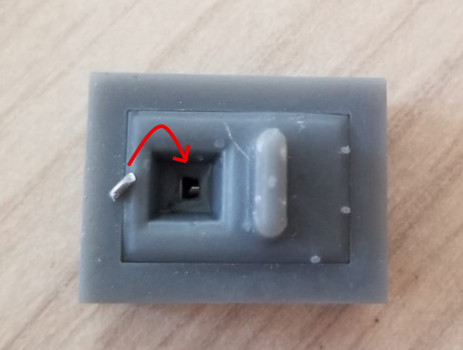{width=40% .center .on-glb}

The result should look like this on both sides of the T-shaft: 

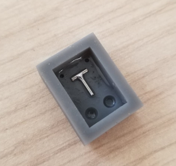{width=40% .center .on-glb}

It is important that the joint is uniform as in the image and that you used enough tin to make a strong union. 

## Elbow ball bearings

These ball bearings have a pin soldered radially as you can se below. 

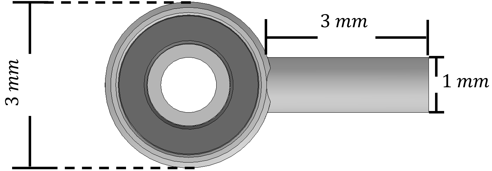{width=50% .center}

The process to solder a pin to the bearing is very similar to the T-shaft process. Place your pre-cut pin in the slot along with the bearing, add the mold lid, and then
add two little bits of tin in each cavity next to the bearing to solder the two corners of the pin, as shown in the image.
Finally, add two drops of phosphoric acid and fuse the little tin bits with the soldering iron by pushing them into the bearing-rod union. 
    
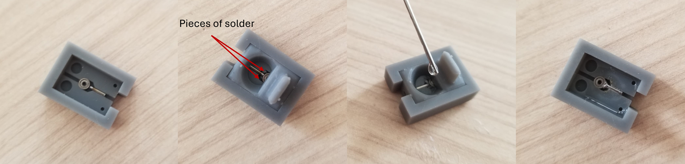{width=90% .center .on-glb}

!!! warning "Soldered bearings"
    If there is tin inside the ballbearing after the process, the piece wont be useful. 
    
    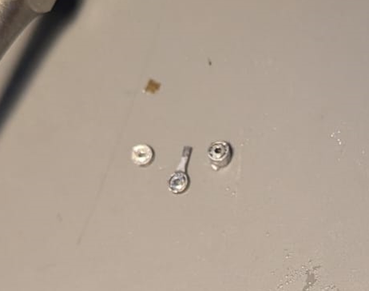{width=40% .center .on-glb}
